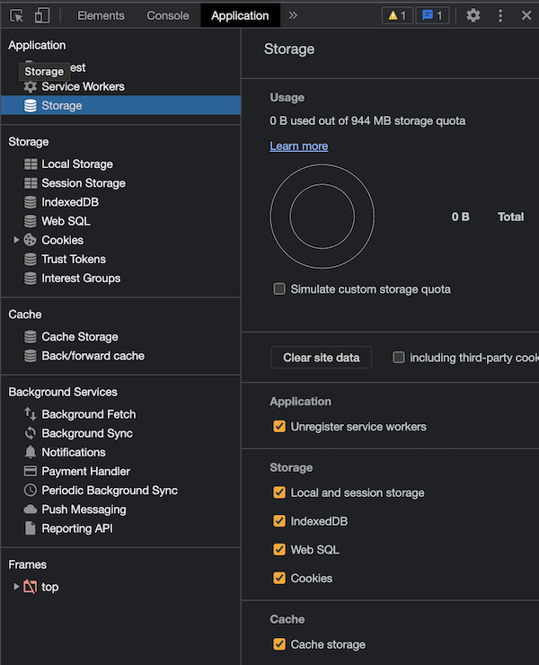

# ブラウザのクライアントサイド storage についてまとめる

@tags: [browser, storage]

@date: [2022-10-24, 2022-10-24]

## はじめに

[前回の Anonymous iframe の記事](https://blog.bokken.io/articles/2022-09-27/about-anonymous-iframe.html)で、storage について触れた。

ブラウザが持つ storage にはどんなものがあるのか気になったので、
[MDN](https://developer.mozilla.org/en-US/docs/Learn/JavaScript/Client-side_web_APIs/Client-side_storage) や [Storage Standard](https://storage.spec.whatwg.org/) を読んでまとめてみる。

## クライアント Storage

クライアント Storage は、JavaScript API が提供されていて、クライアントサイド(ブラウザ)上にデータを保存する仕組みのことをいう。

[MDN](https://developer.mozilla.org/en-US/docs/Learn/JavaScript/Client-side_web_APIs/Client-side_storage)
にはクライアントサイド Storage は、例えば、サイトの個別の設定（色やフォントなど）、以前訪れたときのサイトの行動(ログイン状態、ショッピングカートなど)、Web サイトのアセット(HTML, JavaScript, CSS)、ドキュメントなどを保存するのに使えるとある。

MDN で具体的にクライアントサイド Storage と分類されているのは下記の 4 種類だ。

* Web Storage
    * local storage
    * session storage
* IndexedDB
* CacheAPI
* ServiceWorker

(WebSQL もあるが多くのブラウザやユースケースで deprecated になっており、[W3C の Web Application Working Group もメンテナンスをしておらず](https://www.w3.org/TR/webdatabase/)、 Web Storage や Indexed DB の仕様を策定をしているようだ)

クライアントサイド Storage とサーバサイド Storage はどちらか一方しか使えないようなものではなく、用途によって併用できる。

## Storage の分類

4 種類あるストレージのうち用途が似ているもので分けると下記のようになる。

* Web Storage と IndexedDB
* Cache API と ServiceWorker

それぞれ、アプリケーションデータを保持するために使うのと、キャッシュとして使うというようにざっくりとした利用用途が分かれている。

## Web Storage と IndexedDB

Web Storage と IndexedDB の違いは

* 扱えるデータの種別
* データサイズ
* API

にある。

### WebStorage

Web Storage は sessionStorage と localStorage に分かれる。
データはオリジンごとに分けて保持され、データの保存期間は、 sessionStorage はブラウザ(タブ)が閉じられるまで、 localStorage はブラウザが閉じられたとしても保持される。保存できるデータサイズはユーザ環境に依存するが、5 - 10 MB ほどだ。扱えるデータの種別としては string のみである([Storage.setItem() - Web APIs | MDN](https://developer.mozilla.org/en-US/docs/Web/API/Storage/setItem))。

オブジェクトをセットしても下記のように `toString()` でシリアライズされて保持される。

```javascript
const value = {foo: 'bar'};
window.sessionStorage.setItem('test', value);
console.log(window.sessionStorage.getItem('test'));
// '[object Object]'
```

なので、 複雑なデータ構造を保持する場合は `JSON.stringify()` などで別途 string にシリアライズする必要がある。

上記の例では、setItem と getItem を使っているが、[MDN](https://developer.mozilla.org/en-US/docs/Web/API/Web_Storage_API/Using_the_Web_Storage_API)によると、下記のようにいくつかのアクセス方法がある。

```javascript
localStorage.colorSetting = '#a4509b';
localStorage['colorSetting'] = '#a4509b';
localStorage.setItem('colorSetting', '#a4509b');
```

このように Web Storage の API は比較的かんたんにデータのセットやゲットができる。

### IndexedDB

IndexedDB は Web Storage と違って audio や video といった複雑なデータでも扱うことができる storage だ。トランザクションやインデックスもサポートされており、IndexedDB の名が表すようによくあるデータベースのように使える。また、IndexedDB も localStorage と同様にブラウザを閉じてもデータは保存されている。扱えるデータサイズは10 MB - 2 GB 程度で、Web Storage と比べると遥かに大きい。

API は Web Storage と違って少し複雑になっている。データベースの利用に必要な手順は下記のとおりだ。

1. 初期化処理
   1. データベースを開くリクエストを送る
   2. リクエスト成功時(更新が必要なとき)、データベースにオブジェクトストアを作る
2. データを書き込む
   1. データベースを開く
   2. トランザクションを作る
   3. リクエストを発行する
   4. イベントをハンドルする
3. データを読み込む
   1. データベースを開く
   2. トランザクションを作る
   3. リクエストを発行する
   4. イベントをハンドルする

コードにすると次のようになる。

#### 初期化する

`window.indexedDB.open('db', 1)` で DB を開くリクエストを送る。リクエストオブジェクトはイベントハンドラを設定できるようになっているので、`upgradeneeded` や `success`、`error` といったイベントにハンドラを設定することになる。

```javascript
let db;
// データベースを開くリクエストを送る
const request = window.indexedDB.open('db', 1);
// データベースの更新が必要なとき
request.onupgradeneeded = () => {
  const db = request.result;
  // 今回は users データストアがないときにデータストアを作る
  if (!db.objectStoreNames.contains('users')) {
    db.createObjectStore('users', {keyPath: 'id', autoIncrement: true});
  }
};
request.onsuccess = event => {
    db = request.result;
};
```

#### データを書き込むとき

データを書き込むときは、DB を開くリクエストを送る（DBオブジェクトをキャッシュしていない場合）、トランザクションを張る、リクエストに対するイベントをハンドルする、という流れで処理を行う。ここでは db はキャッシュされている例を紹介する。

```javascript
// トランザクションを張る
let transaction = db.transaction('users', 'readwrite');
// users へのトランザクションを張る
let users = transaction.objectStore('users');

// 書き込むべきユーザを作成する
const user = {name: 'John', email: 'john@example.com'};
// ユーザ書き込みリクエストを送る
const request = users.add(user);

// リクエストが success したときのイベントハンドラを設定する
request.onsuccess = (event) => {
  console.log('success request', event.srcElement.transaction.db);
};
```

#### データを読み込むとき

データを読み込むときはほとんどデータを書き込むときと同様で、users への transaction を張り、読み込みリクエストを送り、リクエストに対するイベントをハンドルするという具合になる。


```javascript
let transaction = db.transaction('users', 'readonly');
let users = transaction.objectStore('users');
const request = users.getAll();
request.onsuccess = (event) => {
  console.log('user', event.srcElement.result);
}
```

### IndexedDB まとめ

ここまで見てきたように IndexedDB は Web Storage と比べて少し複雑に見える。しかし、トランザクションをサポートしていることや、扱えるデータが多数あること、保存できるデータサイズが Web Storage と違うといった点で Web Storage と違った利点がある。

## Cache API と Service Worker

Web Storage と IndexedDB について見てきたところで、次は Cache API と Service Worker について見てみる。

Cache API と Service Worker は一言で言うと、キャッシュやプロキシのために組み合わせて使う仕組みで、 HTTP Request に対して前処理、後処理をしたり HTTP Response をキャッシュするために使う。
今までアプリケーションデータを保存するための Storage を紹介したが、Cache API と Service Worker の組み合わせは少し異なる用途の Storage になる。

### 実際の使い方

Cache API は HTTP Request に対して HTTP Response を保存するための仕組みである。

[MDN](https://developer.mozilla.org/en-US/docs/Learn/JavaScript/Client-side_web_APIs/Client-side_storage#offline_asset_storage) を参考に Cache API と Serivce Worker は下記のように使う。

まず、クライアントサイドで Service Worker の登録を行う。ここでは、Service Worker は `service-worker.js` という名前で記載されているとする。

```javascript
navigator.serviceWorker.register(`/path/to/service-worker.js`).
```

`service-worker.js` には下記のように install イベントと fetch イベントのためのイベントリスナーを設定し、それぞれのイベントのハンドルを行う。

```javascript
self.addEventListener('install', (e) => {
    e.waitUntil(
        caches.open('example-cache-storage')
            .then((cache) => {
                cache.addAll([
                    '/path/to/resource-a',
                    '/path/to/resource-b',
                    '/path/to/resource-c',
                ])
            })
    )
})
self.addEventListener('fetch', (e) => {
    e.respondWith(
        caches.match(e.request).then((response) => response) || fetch(e.request);
    )
})
```

install でやっていることとしては、 Cache Storage を開くことと、Cache する URL を指定することである。
ここで指定された URL のリソースは Fetch され、 Cache Storage にキャッシュされることになる。

一点注意することとしては、 Cache API は HTTP キャッシュヘッダを見ないという点には注意したい。

> Note: The caching API doesn't honor HTTP caching headers.
>
> -- [MDN](https://developer.mozilla.org/en-US/docs/Web/API/Cache#:~:text=entries%20in%20the-,Cache,-object.)


## Additional Storage

Chrome のデベロッパーツールにある Application タブを見ると、Coookie や Trust Tokens、Interest Groups といったものも Storage のようだ。機会があったらこれらについても触れたい。



## おわりに

今回は Client サイドの Storage 4 種類について概観した。

これらの Storage の使い分けについて理解することで、適切なユースケースでそれぞれの Storage を使っていきたい。

## 参考

1. [Client-side storage - Learn web development | MDN](https://developer.mozilla.org/en-US/docs/Learn/JavaScript/Client-side_web_APIs/Client-side_storage)
2. [Storage Standard](https://storage.spec.whatwg.org/)
3. [Client-Side Storage Partitioning | storage-partitioning](https://privacycg.github.io/storage-partitioning/)
4. [Deprecations and removals in Chrome 94 - Chrome Developers](https://developer.chrome.com/blog/deps-rems-94/#deprecate-and-remove-websql-in-third-party-contexts)
5. [Using the Web Storage API - Web APIs | MDN](https://developer.mozilla.org/en-US/docs/Web/API/Web_Storage_API/Using_the_Web_Storage_API)
6. [Storage for the web](https://web.dev/storage-for-the-web/)
7. [Using IndexedDB - Web APIs | MDN](https://developer.mozilla.org/en-US/docs/Web/API/IndexedDB_API/Using_IndexedDB)
8. [Cache - Web APIs | MDN](https://developer.mozilla.org/en-US/docs/Web/API/Cache)
