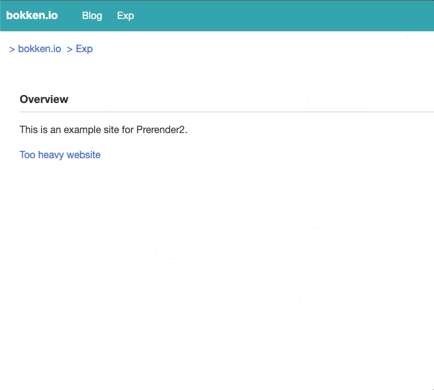

# Prerender2 という機能について

@tags: [Web, browser, Prerender2]

@date: [2022-11-24, 2022-11-24]

## はじめに

Prerender2 という機能の実装が Chrome/Chromium で進んでいる。この機能はページのレンダリングを予め行うことでページを高速に閲覧できるようにするための機能だ。この記事ではなぜ Prerender**2** なのか、どうすれば適用できるのか、使う際の注意点はなにかを 2022/11/23 時点での情報についてまとめる。最新の情報については、それぞれの文書を参照されたい。

## もくじ

<!-- vim-markdown-toc GFM -->

* [Prerender とは](#prerender-とは)
* [Legacy Prerender とはなにか](#legacy-prerender-とはなにか)
* [Prerender2](#prerender2)
    * [Prerender2 を使う方法](#prerender2-を使う方法)
    * [feature detection](#feature-detection)
* [Prerender2 の検討事項など](#prerender2-の検討事項など)
    * [Privacy considerations](#privacy-considerations)
    * [ネットワークリクエストと Cookie について](#ネットワークリクエストと-cookie-について)
    * [HTTP Cache について](#http-cache-について)
    * [`<link rel=prerender>` タグの注意点](#link-relprerender-タグの注意点)
    * [Referrer Policy](#referrer-policy)
    * [target_hint について](#target_hint-について)
    * [API の利用の制限](#api-の利用の制限)
* [おわりに](#おわりに)
* [参考・関連リンク](#参考・関連リンク)

<!-- vim-markdown-toc -->

## Prerender とは

Prerender は Rendering を予め行い、ユーザのリンククリック時にあらかじめレンダリングされた結果を表示することで、閲覧体験を向上させる機能といえる。

近年開発が進んでいるのは Prerender2 という機能だ。過去に Prerender という機能が実装されていたが、それとは別物になる。この記事では読みやすさのために Prerender2 を Prerender2、過去の Prerender を Legacy Prerender と呼称することにする。

## Legacy Prerender とはなにか

現在 Legacy Prerender は機能としては提供されておらず、取り下げられている。なぜ Legacy Prerender は取り下げられたのか。それについては、Prerender の [Intent to Deprecate and Remove: Prerender](https://groups.google.com/a/chromium.org/g/Blink-dev/c/0nSxuuv9bBw) の投稿に下記のように書かれている。

> Prerender is difficult to maintain and wastes resources compared to its performance benefit. More efficient ways to achieve the same performance goal are in development, but as they will behave quite differently from prerender we need to resolve any unknown external dependencies by deprecating prerender cleanly.

* メンテナンスが難しい
* パフォーマンスの恩恵に比べてリソースを消費してしまう
* 別途パフォーマンスを改善するために開発されている NoState Prefetch が prerender に未知の依存を作らないようにする

ということらしい。

ここで、メンテナンスの難しさについては、[WICG/nav-speculation](https://github.com/WICG/nav-speculation/blob/main/triggers.md#general-interop-and-compat-concerns) に少し関連していそうな記載がある。

> Current implementations are also not necessarily compatible with storage partitioning, as they were designed before such efforts. So there may need to be future backward-incompatible changes to them to meet browser teams' new goals around privacy.

現在の実装は storage partitioning との互換性が必要ないときに設計されたため、現在のプライバシーゴールに到達していないとのことだ。この記載は `<link rel="prerender">`、つまり Legacy Prerender が取り下げられた現在では NoState Prefetch についての記載であるが、おそらく NoState Prefetch 以前の機能である Legacy Prerender についても同様なことが予想される。Legacy Prerender が [2011年にアナウンスされている](https://blog.chromium.org/2011/06/prerendering-in-chrome.html)機能であることから、コードが古くなっていて、上記のゴールを達成するためのメンテナンスが難しくなっているのは想像に難くない。

いずれにしても Legacy Prerender は一度こういった背景で取り下げられた。

## Prerender2

2017 年に Intent to Deprecate and Remove: Prerender が出てから 4 年の月日が流れ、2021年 8 月に Prerender2 の仕様に関する文書が作成された。
[Prerender2 のドキュメント](https://docs.google.com/document/d/1P2VKCLpmnNm_cRAjUeE-bqLL0bslL_zKqiNeCzNom_w/edit#heading=h.gfguuhafev5j)には下記のようにある。

> ## What’s about “2”, or why are we resurrecting it?
>
> * We used to have prerendering, but turned it down, and are creating a new one.
> * We think we can bring it back without the problems **of** the past.

過去の Prerender を取り下げた当時の問題を今なら解決できるということらしい。
Legacy Prerender の実装がなくなったり、リファクタを重ねた結果、Prerender2 をモダンな形で実装できるようになったのだろう。
Chromium の Commit を見ても、Legacy Prerender の削除や、Refactor、Prerender2 の実装が行われているのが[伺える](https://chromium-news.vercel.app/?query=Prerender)。

2022年11月24日現在では Android と Desktop 版の Chrome/Chromium で使えるようだ。

### Prerender2 を使う方法

ここまで、Prerender2 の歴史について主に触れてきたが、次節からは Prerender2 をどのように使うのかを紹介する。

Prerender2 の有効化は比較的簡単で [Speculation Rules](https://wicg.github.io/nav-speculation/speculation-rules.html)を用いて行われる。
具体的には次のようになる。

```html
<script type="speculationrules">
{ prerender: [{ source: 'list', urls: ['next.html'] }] }
</script>
```

簡単な[デモページ](https://x.bokken.io/example-prerender2/)を用意した。手元の環境では Chrome Beta の 108.0.5359.48 で動作を確認できた。
Chrome 107.0.5304.110 では確認できなかったので動作確認の際にはバージョンに注意していただきたい。

<div style="display: flex;">
    
    
</div>

内容としては、リンク先のページが大きな画像を表示するサイトで Prerender2 を使うかどうかを切り替えられるのだが、Prerender2 を適用しない場合は遷移後のページでは画像が少し遅れて表示されることが分かる。

また、新しいタブで開いたときにも Prerender2 は働かないので、動作確認の際にリンクをクリックしていただきたい。

### feature detection

Prerender2 は Speculation Rules を利用しているため、Prerender2 を利用するためにはブラウザが Speculation Rules をサポートしている必要がある。
そのための方法としては下記のような形でチェックするようだ。

```javascript
if (HTMLScriptElement.supports && HTMLScriptElement.supports('speculationrules')) {
  console.log('Your browser supports speculationrules.');
}
```

また、Prerender2 でレンダリングされたかどうかは `document.prerendering` を確認するとよい。

## Prerender2 の検討事項など

ここまでで Prerender2 はとても簡単に使える事がわかってきた。
ただ、プライバシーや細かい動作の挙動について懸念することはたくさんある。そちらについてもドキュメントにかかれていたので紹介する。

### Privacy considerations

まずはじめに紹介するのは Privacy Considerations についてだ。 Privacy に関しては下記のように書かれている。

> Prerendering normally raises privacy concerns because the user may not intend to visit the page being prerendered. The privacy risk is smaller in the same-origin case, which is the initial origin trial.

Prerender2 を使うと、あるページにアクセスしたときユーザが意図せず別のページを訪問することになる。
ただ、これは same-origin であれば問題がないため、現状の same-origin Prerender2 であれば特に問題はないということだ。

cross-origin の場合については下記のように記載がある。

> The rest of this section covers the same-origin case. For the cross-origin cases, much work is being done as part of proposed web standards. See this work at https://github.com/jeremyroman/alternate-loading-modes/

cross-origin については今後 Web Standards で議論が進んでいくようだ。

### ネットワークリクエストと Cookie について

ネットワークについて他にも[ドキュメント](https://docs.google.com/document/d/1P2VKCLpmnNm_cRAjUeE-bqLL0bslL_zKqiNeCzNom_w/edit#bookmark=id.vbnic8jwys3e)に記載がある。

> The plan is for the prerendering page to have mostly unrestricted access to network, including having cookies present on the requests.
> This includes for cross-origin subresource requests. While third-party cookies are a known privacy concern, there is ongoing other work in Chromium to reduce the privacy risk of these that we expect to be automatically applied to prerendering. But it is worth noting that that work will likely only restrict cross-site cookies, and not cross-origin ones. Nevertheless, the same-origin prerender does not give the main page any more power to make cross-origin requests than it can already do with an iframe.

Prerender2 では、ネットワークリクエストの際に Prerender されるリクエストに Cookie も付与する。
合わせて、Prerender されるドキュメントが cross-origin のサブリソースを読み込む必要がある際にも Cookie を付与することになる。
これはプライバシーに関する懸念として知られているが、Chromium では別の作業(おそらく CHIPS 関連の作業？)が進行中のため、それが Prerender2 に自動的に適用されることを期待している状態とのことだ。

また、面白いのは cross-origin の iframe については下記にあるように load されるのを遅らせるようになっているらしい。

> One restriction in prerendering is that cross-origin iframes will delay loading until activation. This improves privacy and simplifies cross-process concerns (there are no out-of-process iframes), but it can limit the effectiveness of prerendering if essential content for the page is in the iframe.

これによってセキュリティが向上することができるとのことだ。
また、筆者自身も Prerender2 で考えるべきことを減らせるため、とても良い決断のように思う。

### HTTP Cache について

続いては HTTP Cache に関する挙動だ。 HTTP Cache の節には下記のように書かれている。

> Prerendering a page will modify the normal HTTP cache as if it were a normal navigation. This is the current behavior of NoStatePrefetch.
> However, the long-term goal is for prerendering to use an isolated, ephemeral cache that is only usable by the next top-level navigation or has a timeout on the order of 5 minutes like the current prefetch cache. The cross-origin prerendering milestones will be blocked on the implementation of this cache.

HTTP Cache は Prerender されると通常のリクエストと同様に HTTP Cache が更新される。
これは NoState Prefetch と同じだが、将来的には分離された一時的な Cache を利用するか、PrefetchCache のように 5 分でタイムアウトするようにすることが目標とのこと。

### `<link rel=prerender>` タグの注意点

`<link rel="prerender">` という形では NoState Prefetch が働くだけで、Prerender2 はトリガーされない。

これは下記のような理由からだそうだ。

* `<link rel="prerender">` の挙動を変えるのはリスクであること
* speculationrules はもっとパワフルで柔軟な API になることが想定されている
* Prerender2 がトリガされるのか、NoState Prefetch がトリガされるのか説明が複雑になる

ただ、ドキュメントには下記のようにあり、将来的には `<link rel="prerender">` をサポートする予定なのでいくらか混乱が少なくなりそうだ。

> ## Followup work
> ### Triggering
> Beyond speculationrules, we may trigger in other cases:
>
> * <link rel=”prerender”> and <link rel=”next”>

### Referrer Policy

Referrer Policy について、Prerender のための navigation request は speculation rules を記載されているドキュメントの Referrer Policy を尊重するという記載がある。

> The prerender navigation request respects the referrer policy of the document that uses speculation rules.


ただし、上記の speculation rules のドキュメントの Referrer Policy は Prerender されたドキュメントには伝播されない(つまり、Prerender されたあとは Prerender されたあとのドキュメントの Referrer Policy に従う)ということだろう。また、Prerender された Referrer Policy に従うので覚えておく必要がありそうだ。

> The referrer policy of the triggering document does not propagate to the prerendered document itself. Subresources from the prerendered document respect the referrer policy of the prerendered document.

ただし、これは Speculation Rules に `referrer_policy` を記載できるようになる Intent  ([Intent to Prototype: Speculation rules referrer policy key](https://groups.google.com/a/chromium.org/g/blink-dev/c/qzElfWpzWXg)) が出されているので、 Speculation Rules で Referrer Policy を上書きできるようにもなりそうだ。([WICG/nav-speculation](https://github.com/WICG/nav-speculation/blob/main/triggers.md#explicit-referrer-policy))


### target_hint について

現在デモページの節でも新しいタブで開いた場合には Prerender2 は起動されないようだ。
この新しいタブで開いた際にも Prerender2 を有効にする方法として [`target_hint` の仕様策定](https://github.com/WICG/nav-speculation/blob/main/triggers.md#window-name-targeting-hints)が進んでいる。

これは下記のように `target_hint` というプロパティに browser context の keyword を指定することで、ブラウザにどういったコンテキストでページをレンダリングするかを伝える。

> ```json
> {
>   "prerender": [
>    {"source": "list",
>     "target_hint": "_self",
>     "urls": ["page.html"]
>    },
>    {"source": "list",
>     "target_hint": "_blank",
>     "urls": ["page.html"]
>    }]
> }
> ```

`target_hint` に `_self` を指定すると同じタブ、`_blank` を指定すると新しいタブで開くという具合にブラウザにヒントを出すことができる。
上記のように指定すると、同じタブで開いたとしても新しいタブで開いたとしても Prerender2 がトリガされることになる。

ただし、上記のように 2 つ指定するとリソースを 2 倍消費することになるため、下記のように可能であれば避けた方が良いという記載がある。

> However, in implementations such as Chromium that need the target hint, this will prerender the page twice, and thus use twice as many resources. So this is best avoided if possible.

この target_hint について、現在の実装を確認したが、Chrome Beta の 108.0.5359.48 であってもまだ動作を確認できなかった。
[target_hint に関する CL](https://chromium.googlesource.com/chromium/src/+/df487ceb%5E%21/) は存在するが、まだ browser process はこれを使っていないという記載があるためまだ利用できないようだ。
実装されるのを楽しみに待ちたい。

### API の利用の制限

Prerender されたコンテンツが利用できる API には制限が課されている事がある。

仕様については [Prerendering Revamped](https://wicg.github.io/nav-speculation/prerendering.html#intrusive-behaviors) に記載がある。

また、それぞれの API に関する検討は [Restrictions on prerendered content - Google Docs](https://docs.google.com/document/d/1zY15k_wFTik2EoxBf3_RT7YjYpFMDaeNspy15n0rtww/edit) や [Spread Sheet(public を意図しているようだが現在はアクセス権限がない)](https://docs.google.com/spreadsheets/d/1V9Rm_3XACVHexaI4z41xciZxRh6zWrq5mFfSHYrs1XE/edit?usp=sharing) にまとめられているので、API を使う際にはこちらを見て利用に問題がないか確認した上で利用するのが良いだろう。

## おわりに

今回、実装が進んでいる Prerender2 について現状や使い方、今後について分かっていることを紹介した。
Speculation Rules に指定するだけで簡単に使える仕様でありながら、ドキュメントに記載されている内容の多さや、Prerender2 関連の Commit の多さから苦労が伺える。
これだけの大仕事を、簡単な使い方にまとめてしまえる Chrome / Chromium 開発者のみなさんには畏敬の念を感じずにはいられない。

Prerender2 はまだまだ開発が進んでいくため、これからも動向を楽しみに待ちたい。

もしも、誤りや追加の情報があれば [issue](https://github.com/negibokken/bokken.io/issues) や [@bokken_](https://twitter.com/bokken_) までいただけると嬉しい。

## 参考・関連リンク

1. [P2D: Prerender2 for Desktop - Google Docs](https://docs.google.com/document/d/1EpLshvc9RRW3vswmXsJGrbCkhlFmxDsWfbvgxmYDTfs/edit)
1. [Prerender2 for Desktop - Chrome Platform Status](https://chromestatus.com/feature/5197044678393856)
1. [Prerender2 \[public\] - Google Docs](https://docs.google.com/document/d/1P2VKCLpmnNm_cRAjUeE-bqLL0bslL_zKqiNeCzNom_w/edit)
1. [nav-speculation/triggers.md at main · WICG/nav-speculation](https://github.com/WICG/nav-speculation/blob/main/triggers.md)
1. [Restrictions on prerendered content - Google Docs](https://docs.google.com/document/d/1zY15k_wFTik2EoxBf3_RT7YjYpFMDaeNspy15n0rtww/edit)
1. [Resource Hints](https://www.w3.org/TR/resource-hints/)
1. [Private Prefetch Proxy と Speculation Rulesによるprefetch/prerender](https://blog.araya.dev/posts/2021-08-12/speculation-rules-prefetch.html)
1. [Chrome Prerendering](https://www.chromium.org/developers/design-documents/prerender/)
1. [Chromium Blog: Prerendering in Chrome](https://blog.chromium.org/2011/06/prerendering-in-chrome.html)
1. [Intent to Deprecate and Remove: Prerender](https://groups.google.com/a/chromium.org/g/Blink-dev/c/0nSxuuv9bBw)
1. [ link-type-prerender | HTML Standard](https://html.spec.whatwg.org/multipage/links.html#link-type-prerender)
1. [NoState Prefetch - Google ドキュメント](https://docs.google.com/document/d/16VCYGGWau483IMSxODpg5faZny1FJ6vNK2v-BuM5EhU/edit#heading=h.uajrcfabdbg5)
1. [Introducing NoState Prefetch - Chrome Developers](https://developer.chrome.com/blog/nostate-prefetch/)
1. [No State Prefetch - Chrome Platform Status](https://chromestatus.com/feature/5928321099497472)
