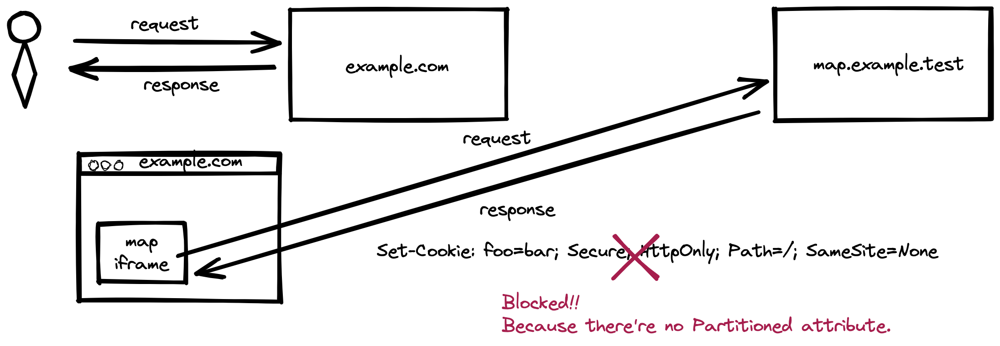
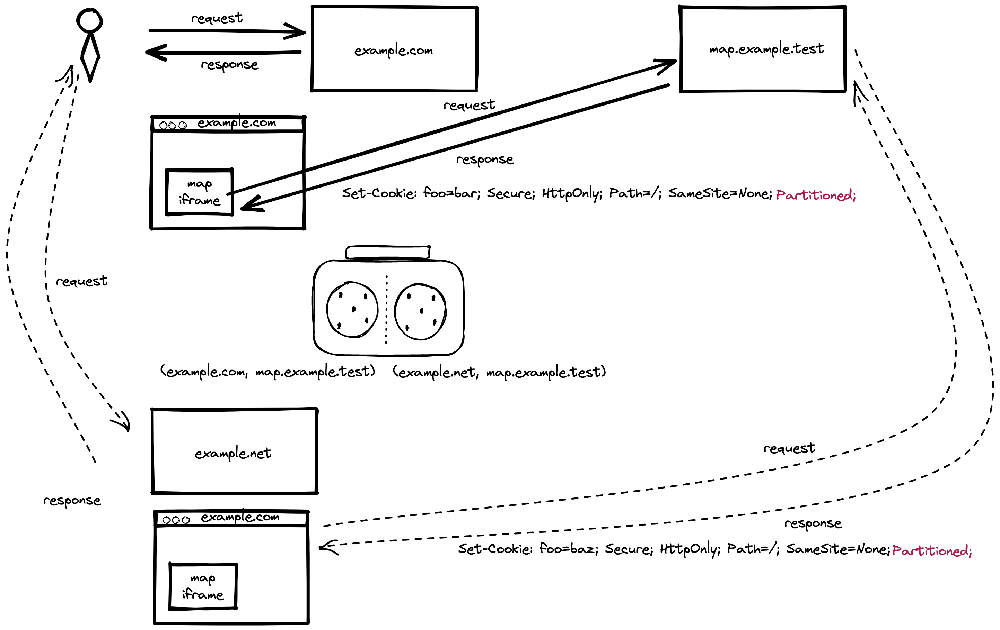
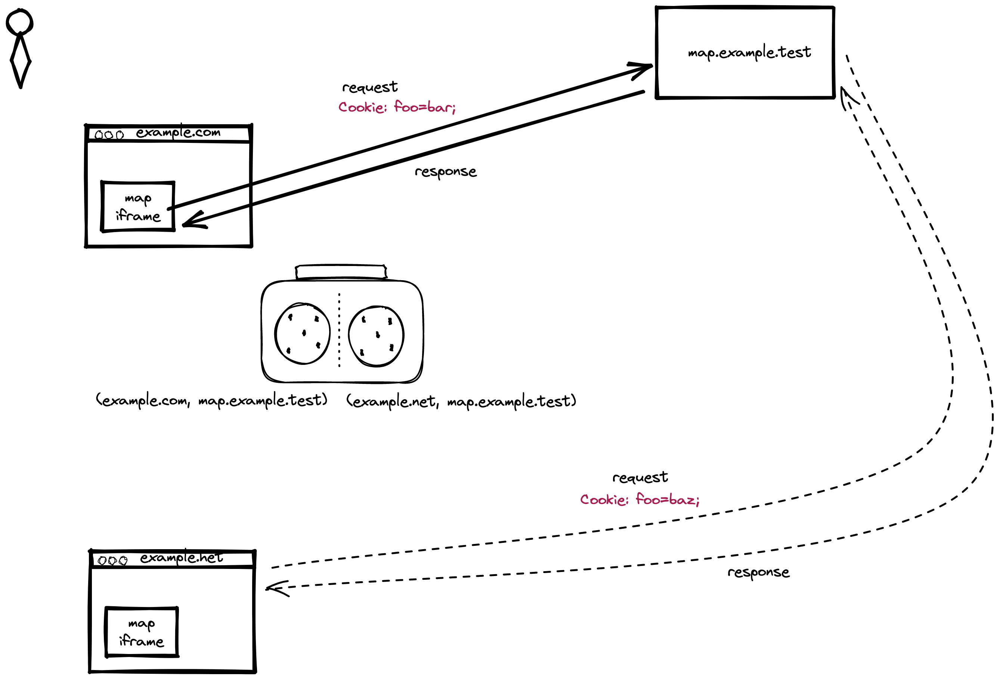

# サードパーティ Cookie をブロックする制限を緩和する CHIPS という仕様について

@tags: [Web, Privacy, Security, Cookie]

@date: [2022-12-30, 2022-12-30]

## はじめに

3rd Party Cookie をブロックする制限を緩和するための仕様である CHIPS が策定されている。

近年、ユーザの Privacy の向上を目的として 3rd Party Cookie をブロックする流れがある。cross site でユーザトラッキングを提供する多くのツールは 3rd Party Cookie を使っているため、3rd Party Cookie をブロックすることで解決しようとするものだ。すでにいくつかのブラウザではこういった動きが見られる([Firefox](https://support.mozilla.org/en-US/kb/enhanced-tracking-protection-firefox-desktop))。

しかし、一部のサイトでは 3rd Party Cookie が有効に使われているケースもある。こういったケースで、Privacy の問題を解決しつつ、3rd Party Cookie を利用できるようにするための仕様が [CHIPS (Cookies Having Independent Partitioned State)](https://github.com/privacycg/CHIPS) だ。 本記事ではこの CHIPS について、なぜ必要なのか、どうやって有効にするのかなどを 2022/12/30 時点の情報でまとめる。


## もくじ

<!-- vim-markdown-toc GFM -->

* [CHIPS (Cookies Having Independent Partitioned State)](#chips-cookies-having-independent-partitioned-state)
    * [トップレベルサイトで分離されるとは？](#トップレベルサイトで分離されるとは)
    * [どのように Cookie が分離されていることを把握するか](#どのように-cookie-が分離されていることを把握するか)
* [簡単なデモ](#簡単なデモ)
    * [デモ動画](#デモ動画)
    * [その他のシナリオ](#その他のシナリオ)
* [各ブラウザベンダのこれまでの動き](#各ブラウザベンダのこれまでの動き)
* [おわりに](#おわりに)
* [参考・関連リンク](#参考・関連リンク)

<!-- vim-markdown-toc -->

## CHIPS (Cookies Having Independent Partitioned State)

[Chromium チームからのアナウンス](https://blog.chromium.org/2020/01/building-more-private-web-path-towards.html)がある通り、今後、3rd Party Cookie はデフォルトでブロックされるようになることが予想される。[CHIPS (Cookies Having Independent Partitioned State)](https://github.com/privacycg/CHIPS) は、その 3rd Party Cookie を Opt-in 形式で使えるようにするための仕様だ。

これを Opt-in する方法は簡単で 下記のように `Set-Cookie` ヘッダに `Partitioned` attribute をつけるだけである。

```http
Set-Cookie: __Host-locationid=187; SameSite=None; Secure; HttpOnly; Path=/; Partitioned;
```

これらの対応は 3rd Party の埋め込まれる側のサイトが対応しなければいけない点に注意する。

`Partitioned` attribute をつけることで、3rd Party Cookie についてはトップレベルサイトで Cookie を分離する代わりに、ブロックされなくなる。

### トップレベルサイトで分離されるとは？

Cookie をトップレベルサイトで分離すると、どういった事が起こるのか？

現状、Cookie は hostname かドメイン名を key として Cookie ストレージを分離していた。CHIPS では、 トップレベル URL のsite (schema とドメイン) と Cookie 送付先の site の両方を使った double key を利用する。

下記のようなレスポンスでは `Partitioned` attribute がないため、 3rd Party Cookie はブロックされる。



しかし、下記のような `Partitioned` attribute がある場合では 3rd Party Cookie はブロックされず、top level のサイトで Cookie が分離されて保存されることになる(`example.com` の `map.example.text` には `foo=bar`、`example.net` の `map.example.test` には `foo=baz` がそれぞれ別途 Cookie として保存される)。



分離されていると、下記のように別のトップレベルサイトからのリクエストに先述したレスポンスで付与された Cookie は送付されず、該当するトップレベルサイトの Cookie が送付される。(`example.com` のフレームにある `map.example.test` には `foo=bar;`、`example.net` のフレームにある `map.example.test` には `foo=baz`)



### どのように Cookie が分離されていることを把握するか

保存された Cookie がトップレベルサイトで分離して保存されているかどうかを確認するためには、リクエストヘッダを確認すればよい。

分離して保持されている Cookie については下記のようにリクエストヘッダに `Sec-CH-Partitioned-Cookies: ?0` が付与される。

```
Sec-CH-Partitioned-Cookies: ?0
Cookie: __Host-name=value
```

## 簡単なデモ

[Third-party store-finder service](https://github.com/privacycg/CHIPS#third-party-store-finder-service) を参考にして CHIPS に関わるデモを用意した。動作については Chrome のバージョン `108.0.5359.124` で `chrome://flags/#partitioned-cookies` と `chrome://flags/#partitioned-cookies-bypass-origin-trial` を有効にした状態の **シークレットウィンドウ** で確認している。

内容としては、ショップ系サイトに組み込むことができる map ツールを模したデモだ。

* [CHIPS example (x.bokken.io)](https://x.bokken.io/example-chips/index.html): Partitioned 属性を付与しており、ブロックされない。
* [CHIPS example (negibokken.github.io)](https://negibokken.github.io/exp/example-of-chips/): Partitioned 属性を付与しており、ブロックされない。かつ、上記のサイトとは Cookie が共有されない
* [CHIPS example (exp.bokken.dev)](https://exp.bokken.dev/example-of-chips/): Partitioned 属性を付与しないため、Cookie がブロックされる(初期位置から動かない)

もしも挙動がおかしい場合は今一度フラグが設定されているか、シークレットウィンドウを使っているかを確認し、Cookie を削除してから試していただきたい。

### デモ動画

上記のデモを筆者の環境で動かしたデモ動画を下記に掲載する。


この動画ではまず `x.bokken.io` にあるサイトから Simple Map App の位置情報をカーソルで更新する(赤い色が真ん中に)。
次に Simple Map App を利用している別のサイトである `negibokken.github.io` にて、同様に Simple Mapp App を確認すると、初期位置である左上に赤い印がある。ここで `negibokken.github.io` で位置情報を更新する(右下まで)が、もともとの `x.bokken.io` では位置情報は更新されていない。
また、最後の `exp.bokken.dev` では同様に Simple Map App を読み込んでいるが、 Cookie に `Partitioned` 属性がないため Cookie がブロックされて位置情報が初期位置から変わらない。

このようにトップサイトごとに Cookie が分離されることで異なるサイト間では情報を共有しないようになる。

同じサイトを再訪問した際には情報が保持されているため、ユーザ体験を維持できる。


### その他のシナリオ

今回は [Third-party store-finder service](https://github.com/privacycg/CHIPS#third-party-store-finder-service) に沿って紹介したが、その他、サポート用の組み込みチャット、ロードバランサによる Cookie の利用などのシナリオが掲載されいてる。その他のシナリオについては [Key Scenario](https://github.com/privacycg/CHIPS#key-scenarios) を参照されたい。

## 各ブラウザベンダのこれまでの動き

これまで Firefox や Safari は独自の仕組みで Cookie を分離し、ユーザの Privacy を保護してきた。

Firefox では [ETP Strict mode](https://support.mozilla.org/en-US/kb/enhanced-tracking-protection-firefox-desktop) という機能によってデフォルトで Cookie をトップサイトごとに分離したり、 Safari では[ヒューリスティックな手法による分離](https://webkit.org/blog/10218/full-third-party-cookie-blocking-and-more/)手法を試し、最終的にはデフォルトで 3rd Party Cookie をブロックするようになった。

一方、デフォルトで分離をしたり、ブロックするということは、これまで動いていたサイトを壊してしまう可能性がある。CHIPS 関連でいうと、例えば、[Key Scenario](https://github.com/privacycg/CHIPS#key-scenarios) に記載されているようなケースだ。
[SmooshGate の事例](https://developer.chrome.com/blog/smooshgate)に見るように、 Web は後方互換性を大事にしているため、後方互換性を壊すような変更は受け入れがたいことがある。

ユーザの Privacy を守ることも大事だが、Web の互換性やエコシステムを破壊しないためにもゆるやかで地道な活動が必要である。Chromium Blog には下記のように、「3rd Party Cookie の制限を緩和する方法を提供してから 3rd Party Cookie を廃止する。しかしこれは我々だけではできない。エコシステムによる協力が不可欠である」、「現在の広告つきの Web サイトのモデルを損なうことは、fingerprinting などのような不透明な技術への誘導になりかねず、それはユーザの Privacy を損なうことになる。だからコミュニティとしてうまくやる必要があるし、うまくやれる」と。

> Once these approaches have addressed the needs of users, publishers, and advertisers, and we have developed the tools to mitigate workarounds, we plan to phase out support for third-party cookies in Chrome. Our intention is to do this within two years. But we cannot get there alone, and that’s why we need the ecosystem to engage on these proposals.
>
> --- [Building a more private web: A path towards making third party cookies obsolete](https://blog.chromium.org/2020/01/building-more-private-web-path-towards.html#:~:text=Once%20these%20approaches,on%20these%20proposals.)
>
> By undermining the business model of many ad-supported websites, blunt approaches to cookies encourage the use of opaque techniques such as fingerprinting (an invasive workaround to replace cookies), which can actually reduce user privacy and control. We believe that we as a community can, and must, do better.
>
> --- [Building a more private web: A path towards making third party cookies obsolete](https://blog.chromium.org/2020/01/building-more-private-web-path-towards.html#:~:text=By%20undermining%20the,must%2C%20do%20better.)

これは、3rd Party Cookie の廃止によって壊れる Web サイトを生まないためには埋め込み側や埋め込まれる側の対応が必須であり、協力が必要であることを訴えているものである。そして、Web という世界を壊さないことや、コミュニティを重視する姿勢が見て取れる。

2020年1月14日に記載されたこの記事の中には、Chrome チームはこれを 2 年以内に実現したいという記載がある。しかし、2022年12月30日現在ではまだ 3rd Party Cookie の廃止は実現に至っていない。COVIT-19 による影響があったことも関係してるが、この計画を慎重に進めていることが伺える。

## おわりに

今回、現在仕様が策定されている CHIPS という仕様や 3rd Party Cookie の流れについてまとめた。
3rd Party Cookie は一概に悪とは言えず、ユースケースを考えればユーザにとって非常に有益な技術である。
CHIPS 関連ドキュメントを読んでそのことが理解できた。また、Web を発展させていくためにはエコシステム全体の協力や、忍耐が必要なことを知れた。
対応されている方々には頭が下がる思いである。

CHIPS については、[Intent to Ship](https://groups.google.com/a/chromium.org/g/blink-dev/c/JNOQvsTxecI/m/WfsTjR89AwA) が出されているため、近いうちに機能がリリースされるものと思われる。また次の発表を待ちたい。

もしも、この記事についてコメントや誤りがあれば、
[@bokken_](https://twitter.com/bokken_) か、[issue](https://github.com/negibokken/bokken.io/issues) までいただけると嬉しい。


## 参考・関連リンク

1. [privacycg/CHIPS: A proposal for a cookie attribute to partition cross-site cookies by top-level site](https://github.com/privacycg/CHIPS)
1. [Cookies Having Independent Partitioned State (CHIPS) - Chrome Developers](https://developer.chrome.com/en/docs/privacy-sandbox/chips/)
1. [Cookies Having Independent Partitioned State (CHIPS) origin trial - Chrome Developers](https://developer.chrome.com/en/blog/chips-origin-trial/)
1. [Enhanced Tracking Protection in Firefox for desktop | Firefox Help](https://support.mozilla.org/en-US/kb/enhanced-tracking-protection-firefox-desktop)
1. [Enhanced Tracking Protection in Firefox for Android | Firefox for Android Help](https://support.mozilla.org/en-US/kb/enhanced-tracking-protection-firefox-android)
1. [SmooshGate FAQ - Chrome Developers](https://developer.chrome.com/blog/smooshgate/)
1. [牧歌的 Cookie の終焉 | blog.jxck.io](https://blog.jxck.io/entries/2020-02-25/end-of-idyllic-cookie.html)
1. [WICG/first-party-sets](https://github.com/WICG/first-party-sets)
1. [Intent to Prototype: Cookies Having Independent Partitioned State (CHIPS)](https://groups.google.com/a/chromium.org/g/blink-dev/c/hvMJ33kqHRo/m/3diUOI0uAQAJ)
1. [Intent to Experiment: Cookies Having Independent Partitioned State (CHIPS)](https://groups.google.com/a/chromium.org/g/blink-dev/c/_dJFNJpf91U/m/OXzFi_6wAwAJ?utm_medium=email&utm_source=footer)
1. [Intent to Ship: Cookies Having Independent Partitioned State (CHIPS)](https://groups.google.com/a/chromium.org/g/blink-dev/c/JNOQvsTxecI/m/WfsTjR89AwA)
1. [Chromium Blog: Building a more private web: A path towards making third party cookies obsolete](https://blog.chromium.org/2020/01/building-more-private-web-path-towards.html)
