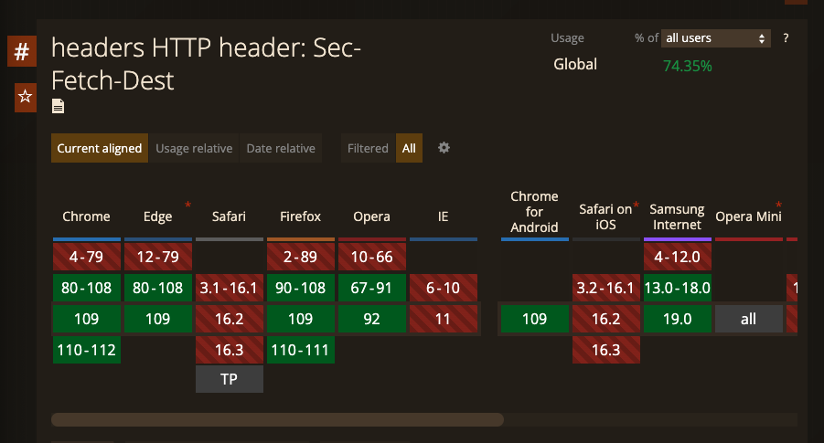

# 不正なリクエストを弾くために使える Fetch Metadata という仕様について

@tags: [Web, App, Sec]

@date: [2023-01-28, 2023-01-28]

## はじめに

リクエストのコンテキストをサーバ側に伝えることで、サーバ側でリクエストが危険なものかを判別するための [Fetch Metadata Request Headers](https://www.w3.org/TR/fetch-metadata/) という仕様がある。今回、このヘッダがどういったものなのかについて [Fetch Metadata Request Headers](https://www.w3.org/TR/fetch-metadata/) を読んだり、周辺のドキュメントを読んでまとめる。

## TL;DR

* Fetch Metadata ヘッダはクライアント側では特に何も設定する必要はなく、サポートされていればブラウザによってリクエストに自動的にヘッダに付与されサーバに送付される
* サーバは送られてきた Fetch Metadata をもとに CSRF などの、攻撃の可能性があるリクエストを弾く事ができる
* 2023/01/28 現在で、 Chromium 系のブラウザと Firefox でサポートされている。 Safari ではもうじきサポートされそう
* `Sec-` prefixed なのは、[forbidden header name](https://fetch.spec.whatwg.org/#forbidden-request-header) として、JavaScript から変更できないヘッダにするため

## Fetch Metadata とは

Fetch Metadata とは、怪しいリクエストを弾くポリシーを構築するために利用できるヘッダであるといえる。

例えば、[CSRF](https://portswigger.net/web-security/csrf) や [XSSI](https://portswigger.net/research/json-hijacking-for-the-modern-web)、[cross-site search](https://xsleaks.dev/docs/attacks/xs-search/) やその他の [timing attack](https://owasp.org/www-pdf-archive/2018-02-05-AhmadAshraff.pdf) などの攻撃を受けたときに、サーバ側はリクエストのコンテキストがわからないため、不正なリクエストかを判別できず、リクエストに対するレスポンスを生成せざるを得ない。

特に timing attack のように、実行時間の長さを情報として利用されて攻撃を受けてしまう場合は、レスポンスを生成するための処理を実行すること自体が攻撃者の情報源になり得る。

いずれの攻撃にしても、ある程度リクエストのコンテキストが分かれば防ぐことができる。

ここで、コンテキストというのはリクエストの状況のことを指している。例えば、cross-site からのリクエストでユーザ情報の削除などは行われない、銀行にあるすべてのお金を送金するというリクエストが、`` タグから発行されることはないといった具合だ。(もちろんサービスの特性によってはこれらのリクエストが問題ないこともあるかもしれない)

こういった明らかに怪しいリクエストを予め防ぐために、ブラウザが付与する Fetch Metadata を利用できる。

## Fetch Metadata 関連のヘッダ

では、どういったヘッダが送られてくるのか？ Fetch Metadata には下記のヘッダがある。

* `Sec-Fetch-Dest`
* `Sec-Fetch-Mode`
* `Sec-Fetch-Site`
* `Sec-Fetch-User`

それぞれどういったヘッダかについて紹介する。

### `Sec-Fetch-Dest`

`Sec-Fetch-Dest` リクエストがどこで発されたのかを表す文字列が入る。

有効な `Sec-Fetch-Dest` は "audio", "audioworklet", "document", "embed", "empty", "font", "frame", "iframe", "image", "manifest", "object", "paintworklet", "report", "script", "serviceworker", "sharedworker", "style", "track", "video", "worker", "xslt" である。

この destination 自体は [Fetch Standard](https://fetch.spec.whatwg.org/#concept-request-destination) で定義されている。

`Sec-Fetch-Dest` を利用することで、`Sec-Fetch-Dest: image` の場合には img タグで利用するためのリクエストである事がわかる。そのため、先程の例にあった 「img タグからの預金残高をすべて送金する」というリクエストが不正であることが分かっていれば、このリクエストを弾くことができる。

### `Sec-Fetch-Mode`

`Sec-Fetch-Mode` は request 時の mode を表している。

有効な `Sec-Fetch-Mode` は "cors", "navigate", "no-cors", "same-origin", "websocket" である。

この mode については destination と同様に [Fetch Standard](https://fetch.spec.whatwg.org/#concept-request-mode) で定義されている。

この mode は、例えば、`Sec-Fetch-Mode: navigation` のリクエストが `Sec-Fetch-Dest` が `<object>` や `<embed>` で発行されていたら、（もし embed や object で利用されることがないのが明らかであれば)弾くために使える。

### `Sec-Fetch-Site`

`Sec-Fetch-Site` はリクエスト先とリクエスト元がどういう関係のサイトかを表している。

有効な `Sec-Fetch-Site` は "cross-site", "same-origin", "same-site", "none" である。

none はユーザ起因の操作(URLバーにURLを入力して遷移する、ブックマークからサイトにアクセスするなど)によってリクエストが発生したときに設定される。

`Sec-Fetch-Site` は、例えば cross-site なリクエストが画像や favicon といったサブリソースに限定されることが分かっている場合にはサブリソース以外へのリクエストの場合は弾く、といった具合に使うことができるだろう。

### `Sec-Fetch-User`

`Sec-Fetch-User` の value は boolean (`?0` か `?1`) で表現されている。

navigation request のときのみ付与され、また true のときのみ送付される。

このヘッダはユーザ操作による navigation リクエストか、`window.location` が JavaScript で変更されたときや、form の送信時の navigation リクエストとを区別できる。

## どのようにしてリクエストを防ぐのか

では、これらのヘッダをつかってどのようにリクエストを防ぐのか。

基本的にはヘッダの組み合わせで弾くロジックを組み込むことになる。

[web.dev](https://web.dev/fetch-metadata/#implementing-a-resource-isolation-policy) では、サーバサイドでミドルウェアのロジックを記載する例を紹介している。
[fetch-metadata - npm](https://www.npmjs.com/package/fetch-metadata)のように、ライブラリを利用する手もあるだろう。

また、仕様にはリバースプロキシや CDN レイヤーでブロックできそうだというコメントがある。そのうちクラウドベンダがそういった機能をリリースするかもしれない。

いずれにしても、自分たちが提供するエンドポイントへのリクエストがどういった条件では不正なのか？を整理する必要があるため、効果的に適用するためには、CSP のように少し手間を要する。

## `Sec-Fetch` 系ヘッダのサポート状況

`Sec-Fetch` 系ヘッダは下図のように Chromium 系のブラウザや Firefox ではサポートされており、Safari はまだサポートされていない。

ただ、[Safari Technology Preview 160 のブログ](https://webkit.org/blog/13639/release-notes-for-safari-technology-preview-160/)を見ると、160 の[コミット範囲](https://github.com/WebKit/WebKit/compare/ec9adcfcd3db270348a5b7a95cdf500bdccbf088...5ec07d1125db2d13bd0cde752cf580d87d7ff9f7) に [Enable FetchMetadata のコミット](https://github.com/WebKit/WebKit/commit/cb60df93ab8cb5be5252409d0f934a0b5fabe082) が含まれている。もう時期リリースされることになるだろう。

## おわりに

今回、もうじき主要ブラウザベンダで実装されそうな Fetch Metadata について紹介した。

Fetch Metadata はリクエストのコンテキストをサーバ側に伝えるというシンプルな仕様であるが、不正なリクエストの判別に必要な情報が整理され、標準化されたという点で画期的だったと言えるのではないか。

不正なリクエストを弾くためのポリシーを決めるのには、自分たちのサービスのエンドポイントの整理が必要ではある。

導入にはまだ及び腰であれば、ヘッダのログを残しておくことで怪しいリクエストに気づくことができる。ルール設定が難しい場合はまずはログからはじめてみるのが良いかも知れない。

もしも、間違いがあったりコメントがあったら [GitHub の issue](https://github.com/negibokken/bokken.io/issues) か [@bokken_](https://twitter.com/bokken_) までいただけると嬉しい。

    
付録: `Sec-` prefixed ヘッダの `Sec-` がついている理由

### `Sec-` prefixed ヘッダの `Sec-` がついている理由

現状では、 `Sec-Fetch` や `Sec-CH-UA` などの prefix が存在している。

それぞれ、`Sec-Fetch` は [Fetch Metadata Request Headers](https://www.w3.org/TR/fetch-metadata/)、`Sec-CH-UA` は [User-Agent Client Hints](https://wicg.github.io/ua-client-hints/) で定義されている。

この `Sec-` prefix については、その答えは [Fetch Metadata Request Headers](https://www.w3.org/TR/fetch-metadata/#sec-prefix) に下記のように記載されている。

> Each of the headers defined in this document is prefixed with Sec-, which makes them all [forbidden header names](https://fetch.spec.whatwg.org/#forbidden-header-name), and therefore unmodifiable from JavaScript. This will prevent malicious websites from convincing user agents to send forged metadata along with requests, which should give sites a bit more confidence in their ability to respond reasonably to the advertised information.
>
> --- [Fetch Metadata Request Headers](https://www.w3.org/TR/fetch-metadata/#sec-prefix)

つまり、 `Sec-` prefixed な理由は、 [Fetch Standard](https://fetch.spec.whatwg.org) で定義されている forbidden header name にして JavaScript から変更できないようにするためとのこと。こうすることで malicious なサイトがヘッダを JavaScript で偽装してくることを防げる。

引用元の [Fetch Standard](https://fetch.spec.whatwg.org/#forbidden-request-header) にも下記のように記載されている。

> These are forbidden so the user agent remains in full control over them.
>
> Header names starting with `Sec-` are reserved to allow new headers to be minted that are safe from APIs using fetch that allow control over headers by developers, such as XMLHttpRequest. [XHR](https://fetch.spec.whatwg.org/#biblio-xhr)
>
> --- [Fetch Standard](https://fetch.spec.whatwg.org/#forbidden-request-header)

Header の仕様 ([5.1. Headers class - Fetch Standard](https://fetch.spec.whatwg.org/#headers-class)) に、 header の validate に関する定義があるが、forbidden reqeust-header の場合は無効と判定される。Header class のメソッドのうち変更が発生するメソッドでは validation のステップがあるため、forbidden な場合は処理が中断されるようになっている。

こうすることで、ヘッダが変更されないことを保証するようだ。

## 参考リンク

- [Fetch Metadata Request Headers](https://www.w3.org/TR/fetch-metadata/)
- [Fetch Standard](https://fetch.spec.whatwg.org)
- [User-Agent Client Hints](https://wicg.github.io/ua-client-hints/)
- [Protect your resources from web attacks with Fetch Metadata](https://web.dev/fetch-metadata/)
- [Fetch Metadataリクエストヘッダについて (Sec-Fetch-*) - ASnoKaze blog](https://asnokaze.hatenablog.com/entry/2019/02/15/013557)
