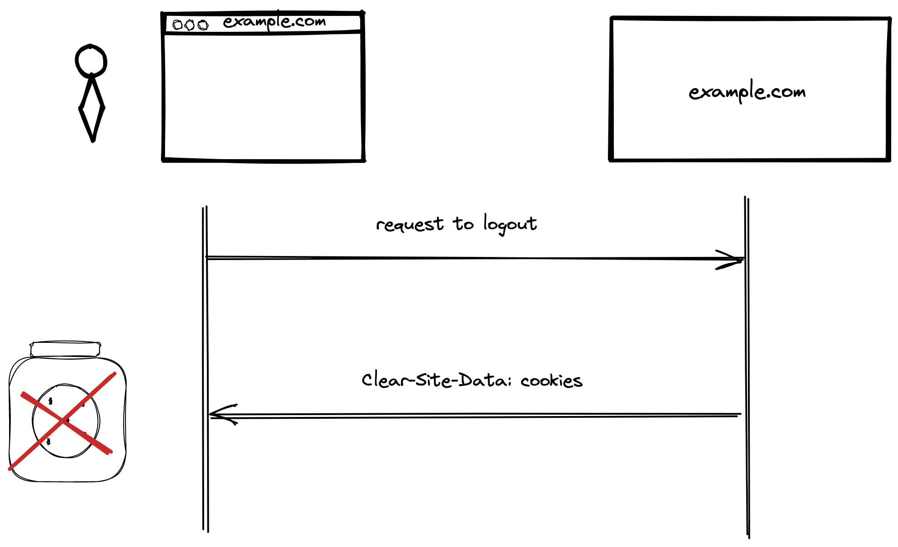
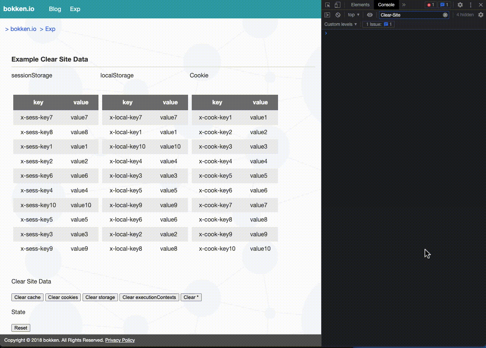

# クライアントの Cookie などのデータを削除する Clear Site Data という仕様について

@tags: [Clear-Site-Data, storage, Cookie]

@date: [2023-02-28, 2023-02-28]

## はじめに

Clear-Site-Data というクライアントサイドのデータを削除するための[仕様](https://w3c.github.io/webappsec-clear-site-data/)がある。提案自体は2015年頃からある仕様だが、[最近 Safari の Beta Release にリリースされ](https://developer.apple.com/documentation/safari-release-notes/safari-16_4-release-notes#HTTP)、もうすぐ主要ブラウザで実装が出揃う形になる。

この記事では、Clear Site Data とはどういう仕様なのかをまとめる。

## Clear Site Data とは

Web アプリケーションでは、オフライン時にも利用できるようにリソース (データ) をキャッシュしたり、パフォーマンスを高めるため、 local マシンにリソース (データ) を保持することがある。また、サービスをログインするのに Cookie にセッション情報 (データ) を保持したりする。

これらの保存されたデータについて、不要になった場合には削除したくなるケースがある。
例えば、キャッシュしている内容が古くなってしまっているときや、ログアウトをしたとき、アカウントを削除したときなどだ。また、脆弱性のあるバージョンの Web サービスの ブラウザキャッシュや HTTP cache が消されたことを確実にしたいケースなどがあるだろう。

API が提供されている storage や、HttpOnly がついていない Cookieは JavaScript で消せる。ただし、HttpOnly がついている Cookie や ブラウザキャッシュ、HTTP cache は削除するのが困難だ。

これらの削除を Web アプリケーション開発者が、効率よく実施できるようにするためのヘッダが `Clear-Site-Data` だ。

## Clear-Site-Data ヘッダ

`Clear-Site-Data` は HTTP Response によって指定する。

現状、このヘッダに指定できるのは、 "cache", "cookies", "storage", "executionContexts", "*" の [5 種類が指定可能](https://w3c.github.io/webappsec-clear-site-data/#header)だ。

指定する際には下記のように指定する。

```http
# wildcard
Clear-Site-Data: "*"

# Cookie, storage
Clear-Site-Data: "cookies", "storage"
```

例えば、ログアウトをしたいとなったときは下記のようにリクエストを送って、レスポンスヘッダに `Clear-Site-Data` を指定して Cookie を削除することになるだろう。



### それぞれの値が削除する対象

ではこの cache, cookies などの指定がどういったものを削除するのか、仕様に記載されている範囲でまとめる。
ブラウザの実装はそれぞれ異なっていたり、そもそもサポートされていなかったりするので、実際に使用する前には挙動を確認していただきたい。

#### cache

cache に含まれるものとしては下記のものがあるようだ。

- HTTP キャッシュ
- ブラウザキャッシュ
- prerendered page
- script cache
- shared cache
- など

詳しくは [4.2.5. Clear DOM-accessible storage for origin | Clear Site Data](https://w3c.github.io/webappsec-clear-site-data/#clear-dom) の "cache" の部分にある。

#### cookies

cookies はその名の通り Cookie のみで、response URL に紐づく Cookie が削除される。

#### storage

storage というと localStorage や sessionStorage はもちろん、その他にも下記のような storage も含めて削除されるようだ。

- localStorage
- sessionStorage
- IndexedDB
- Service Worker Registration
- AppCache (deprecated)
- WebSQL
- FileSystem API
- Plugin Data

詳しくは [4.2.5. Clear DOM-accessible storage for origin | Clear Site Data](https://w3c.github.io/webappsec-clear-site-data/#clear-dom) の "storage" の部分にある。

#### executionContexts

executionContexts は、ブラウザの実行コンテキストを削除してリロードする。これは
[4.2.5. Clear DOM-accessible storage for origin | Clear Site Data](https://w3c.github.io/webappsec-clear-site-data/#clear-dom) にある例を見ると、`https://example.com/clear` へのリクエストに対して、`Clear-Site-Data: executionContext` があったときに、コンテキストを削除してリロードするとある。


## Clear-Site-Data の各値のサポート状況

だが、それぞれサポート状況にはばらつきがあるようだ。Safari は次のリリースですべてのディレクティブがサポートされる形になりそうだ。

|   | cache | cookies | storage | executionContexts | * |
|:-:|:-:|:-:|:-:|:-:|:-:|
| Chrome | o | o | o | x | o |
| Firefox | △(※1) | o | o | x | o |
| Safari (※2) | o | o | o | o | o |

※1: 設定により有効化する必要がある。

※2: Release 164 (Safari 16.4, WebKit 18616.1.2)


## デモサイト

[簡単なデモサイト](https://x.bokken.io/example-clear-site-data/index.html)を用意した。
sessionStorage と localStorage と Cookie を用意し、Clear-Site-Data つきの response を返すエンドポイントにリクエストして挙動を確認するというものだ。以下のように、cookie や storage が削除されている様子がみられる。



cache については一部 asset が memory cache から使われていたのだが、これが memory cache から使われなくなるという挙動を確認している。

また Safari では executionContexts によって、ブラウザのリロードが発生することを確認できている。


## 各ブラウザベンダによるサポートの歴史

Clear Site Data のドラフトの [commit](https://github.com/w3c/webappsec-clear-site-data/commit/4c69380519642aa764a8d89ed16a884bb1d75b01) を見ると、Clear Site Data のドラフト自体は 2015年6月22日に始まっている。

[Clear-Site-Data のサポート状況](https://caniuse.com/?search=clear%20site%20data)を見ると、Chrome と Firefox では比較的昔からサポートされていたようだ。

Safari が今までサポートしていなかったのには何かしら懸念があるのかと思い、[issue](https://bugs.webkit.org/show_bug.cgi?id=203215) や、[メールのアーカイブ](https://lists.webkit.org/pipermail/webkit-dev/)を探してみたが、別段サポートに対してネガティブなコメントがあった様子は見受けられなかった。なので、急にサポートされなくなるといった危険はなさそうだ。

## 注意点

仕様の [6.2. Remnants of data on disk.](https://w3c.github.io/webappsec-clear-site-data/#remnants) に記載があるが、`Clear-Site-Data` を使う際には、データの完全な削除が約束されるわけではないことに注意したい。

例えばなんらかの理由でブラウザがクラッシュしたり、コンピュータが途中でシャットダウンしてしまったら、データがディスクから中途半端に削除されることもありえる。またブラウザの実装の不備でデータがディスクに残ってしまうこともありある。これらの点には注意して `Clear-Site-Data` を利用したい。

## おわりに

今回、主要なブラウザに実装されそうな Clear Site Data という仕様についてまとめた。

ログアウトやアカウント削除時には `Clear-Site-Data` が使えると便利そうだ。特にアカウント削除の際、ブラウザに下手な情報を残さないようにするのは Web アプリケーション開発者としては心がけておきたい。

根本原因は異なるが、[BASE のインシデント発生時](https://devblog.thebase.in/entry/2022/04/13/114714#:~:text=%E3%81%A8%E3%81%84%E3%81%86%E3%81%93%E3%81%A8%E3%81%A7%E3%81%99%E3%80%82-,%E3%81%9D%E3%82%82%E3%81%9D%E3%82%82%E3%81%AA%E3%81%9C%E5%90%8C%E3%81%98key%E3%81%AECookie%E3%81%8C%E4%BA%8C%E7%A8%AE%E9%A1%9E%E3%81%A7%E3%81%8D%E3%81%A6%E3%81%97%E3%81%BE%E3%81%86%E3%81%AE%E3%81%8B,-THEBASE%20%E3%81%AECookie)にも Cookie が削除されずに困ってしまったケースが見受けられた。こういった、いざというときにも、`Clear-Site-Data` が使えるかもしれない。

ブラウザキャッシュや HTTP Cache の削除については、全ブラウザがデフォルトで使えるわけではないので、ユーザ側のよくわからないキャッシュのせいでおかしな挙動をしてしまうケースにはまだしばらく悩まされることになりそうだ。

とはいえ、今までクライアントのストレージをサーバ側で簡単に削除する方法自体がなかったことを考えると大きな進歩のように感じる。今後のサポート拡大を待ちたい。

もしも、誤りや追加の情報があれば [issue](https://github.com/negibokken/bokken.io/issues) や [@bokken_](https://twitter.com/bokken_) までいただけると嬉しい。


## 参考資料・リンク

- [Clear Site Data](https://w3c.github.io/webappsec-clear-site-data/)
- [203215 – Implement support for the Clear-Site-Data HTTP header](https://bugs.webkit.org/show_bug.cgi?id=203215)
- [Clear-Site-Data - HTTP | MDN](https://developer.mozilla.org/en-US/docs/Web/HTTP/Headers/Clear-Site-Data)
- [Clear-Site-Data Header | blog.jxck.io](https://blog.jxck.io/entries/2018-07-24/clear-site-data.html)
- [Clear-Site-Dataヘッダでブラウザに記憶されているデータを消す - ASnoKaze blog](https://asnokaze.hatenablog.com/entry/2018/07/24/020517)
