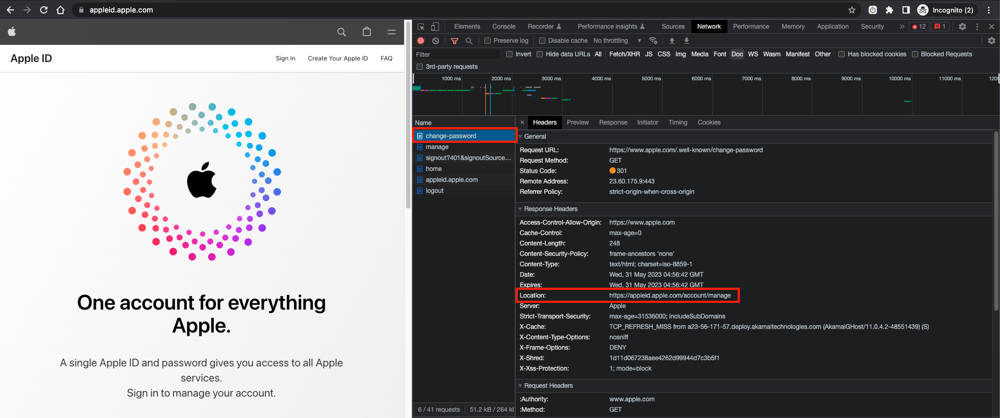
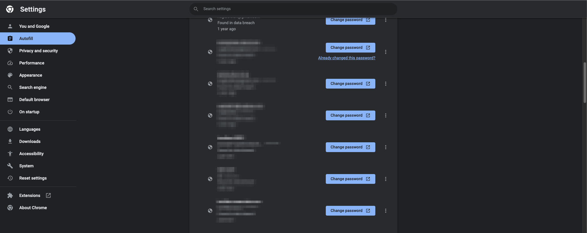
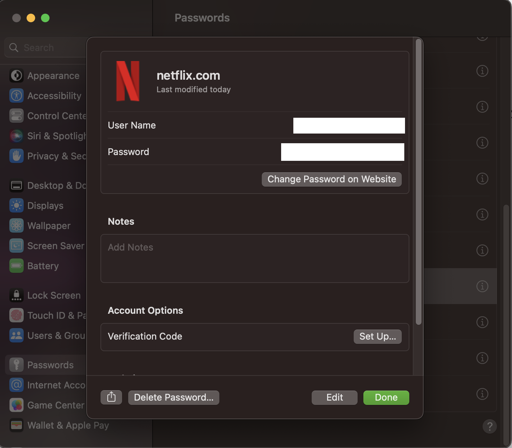

# パスワード変更用のURLを明示すためのwell-known URL for Changing Passwordsという仕様について

@tags: [well-known, appsec]

@date: [2023-05-31, 2023-06-02]

## はじめに

パスワード変更のためのURLを示すための、[A Well-Known URL for Changing Passwords](https://w3c.github.io/webappsec-change-password-url/) という仕様が存在する。

この仕様は主にクライアントサイドのパスワード管理ツールで使われる想定の仕様だ。

本記事ではこの仕様がどういうものか、どういった利点があるのかについてまとめる。

## パスワード管理ソフトとその課題

パスワード管理ツールはクロスサイトでのパスワードの再利用を防いだり、オートフィルをしてユーザビリティを高めてくれる良いツールだ。 ブラウザにもパスワード管理ツールが搭載されていたり、有名どころでは1PasswordやBitwardenのようなツールがある。

これらのツールの中にはパスワードの強度を教えてくれる機能や、漏洩しているパスワードを教えてくれる機能がある。ただ、パスワードを変更するためのURLが分からず、Webサイト上を探すのが面倒くさくて変更していない、という人もいるのではないだろうか。

そういった時に、プログラマティックにパスワードを変更できればとても便利だ。それを解決するための仕様が、[A Well-Known URL for Changing Passwords](https://w3c.github.io/webappsec-change-password-url/)だ。

## Well-Known URL for Changing Passwordsとは

具体的に、[A Well-Known URL for Changing Passwords](https://w3c.github.io/webappsec-change-password-url/)で実施することは`/.well-known/change-password`をserveして、パスワード変更画面のURLにリダイレクトするだけである。

あるいは、`<meta http-equiv="refresh" content="0;url=https://example.com/settings/password">` のような、`http-equiv="refresh"`とパスワード変更画面のURLをcontentに持つmetaタグをserveする形でも良いようだ。

URLへのリクエストを実際のパスワード変更画面へリダイレクトする際には302,303,307を使うことが推奨されている。

> Servers should redirect HTTP requests for an origin’s change password url to the actual page on which users may change their password by returning a response with a redirect status of 302, 303, or 307, and a Location header. [FETCH] [HTTP-SEMANTICS] Clients must handle such redirects when requesting a change password url.
>
> -- https://w3c.github.io/webappsec-change-password-url/

www.apple.com では下記のように301でリダイレクトされた。

(推奨は302,303,307なので改善の余地はあるかもしれない)

ただし、スペックに以下のようにあるため、`/.well-known/change-password` に**直接パスワード変更のページを配置するべきではない**ので、その点は注意したい(`/.well-known/change-password`のアクセスを受けて、別ページにリダイレクトする)。

> Servers must not locate the actual change password page at the change password url, per RFC8615 §1.1 Appropriate Use of Well-Known URIs. Clients must handle ok status responses when requesting a change password url.
>
> -- https://w3c.github.io/webappsec-change-password-url/

## Well-Known URL for Changing Passwords普及後の世界

Well-Known URL for Changing Passwordsの活用のイメージとしては、パスワード管理ツールで、脆弱なパスワードだと分かったときに、「Change this password」ボタンが出てきて、クリックすればパスワード変更画面に遷移し、現在のパスワードと、新しい脆弱でないパスワードが埋まっていてあとは変更ボタンを押すだけ、というものだ。うまくいけば数クリックで新しいパスワードに変更できるので、とても簡単なように思う。

非常に便利な仕様だが、現在はW3Cの[First Public Working Draft](https://www.w3.org/2004/02/Process-20040205/tr.html#first-wd)という状態だ。まだ、正式な仕様ではないため、普及するとしてもまだ先だろう(とはいえ仕様のリポジトリしばらくアクティブに動いてなさそうだ)。

## 現在の対応状況

2023年5月28日現在で、いくつかのメジャーなサイトで確認してみたところ、下記のような状況だった。

|サイト名| 対応状況 |
|:-:|:-:|
|accounts.google.com (※)|o|
|facebook.com| o |
|www.apple.com| o |
|netflix.com| o |
|amazon.co.jp| x |
|microsoft.com| x |
|twitter.com| o |
|github.com| o |
|yahoo.co.jp| x |
|line.me| x |

※www.google.com ではない点に注意

対応状況はまちまちなようだ。

### パスワード管理ツール側の対応状況

また、パスワード管理ツールついて、Chromeのパスワード管理ツールではCheck Passwordとしたあとの画面で、下記のようにChange Passwordというボタンが出てきて、(サポートされているサイトでは) `/.well-known/change-password`にリクエストするのを確認できた。

[仕様のリポジトリのREADME](https://github.com/w3c/webappsec-change-password-url)によると、iCloud Keychain on iOS 12、Safari 12、 1Password、Backdrop CMSは[A Well-Known URL for Changing Passwords](https://w3c.github.io/webappsec-change-password-url/)をサポートしているようだ。

ただ、筆者が確認した限りでは、macOSのパスワード管理ツールやSafariのパスワード管理ツールではChange password on Websiteというボタンはあるのだが、Webサイトのトップページ(対応済みサイトであってもパスワード変更画面ではない)に飛ぶのみであった。

## おわりに

今回、パスワード変更用のURLを明示すためのwell-known URLという仕様について紹介した。
まだ広く普及している状況ではなく、例に示したような形でパスワード変更の負担を減らすようなユーザビリティは実現されていない。

今後パスワードレス認証が主流になっていくとしても、パスワードはまだしばらく生き残るはずだ。[@agektmr](https://twitter.com/agektmr)さんも、[web.dev](https://web.dev/change-password-url/)で同様の記事を2020年に書かれている。
以上の状況を踏まえると、この[A Well-Known URL for Changing Passwords](https://w3c.github.io/webappsec-change-password-url/)という仕様の対応によって、一定数以上救われるユーザはいるのではないだろうか。サイト提供者や、パスワード管理ツール開発者のみなさんはぜひ対応していただきたいと思う。

もしも、誤りや補足の情報があれば [issue](https://github.com/negibokken/bokken.io/issues) や [@bokken_](https://twitter.com/bokken_) までいただけると嬉しい。

## 参考資料・リンク

1. [A Well-Known URL for Changing Passwords](https://w3c.github.io/webappsec-change-password-url/)
1. [w3c/webappsec-change-password-url: A Well-Known URL for Changing Passwords](https://github.com/w3c/webappsec-change-password-url)
1. [A well-known URL for changing passwords - Chrome Platform Status](https://chromestatus.com/feature/6256768407568384)
1. [Help users change passwords easily by adding a well-known URL for changing passwords](https://web.dev/change-password-url/)
