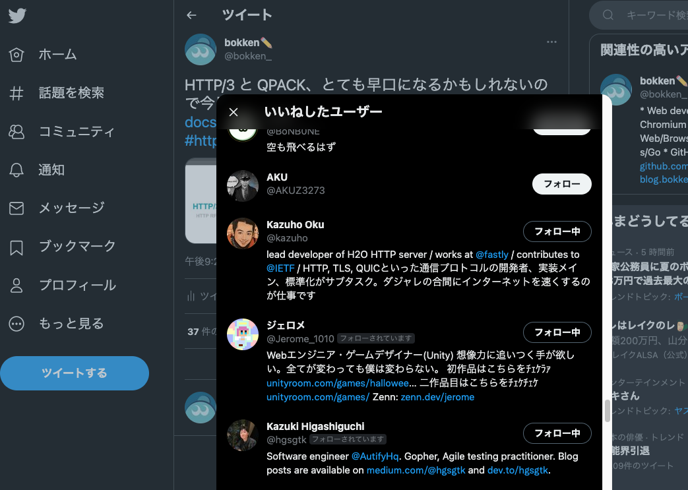

# HTTP RFC Publication Study で HTTP/3 について発表しました

@tags: [HTTP/3, RFC]

@date: [2022-06-30, 2022-06-30]

## はじめに

[HTTP RFC Publication Study](https://web-study.connpass.com/event/250730/)に発表者として参加した。

その際に使った資料は[こちら](https://docs.google.com/presentation/d/1_4LZNXbPHdQ48-UnFWtHkJ4JaTQ2hsP695hZePUcb0c/edit?usp=sharing)で公開している。

<iframe src="https://docs.google.com/presentation/d/e/2PACX-1vQJJG6Yq1HtN0Yq146b-ektkfm2DBs7oni9-5Zi24PMqryXe00jQE5LInT6NqrTBRkfUEUl1LpBgaL5/embed?start=false&loop=true&delayms=3000" frameborder="0" width="960" height="569" allowfullscreen="true" mozallowfullscreen="true" webkitallowfullscreen="true"></iframe>

詳細はここの
[Jxck さんのブログ](https://blog.jxck.io/entries/2022-06-16/HTTP-RFCs.html#http-rfc-publication-study) で触れられているが、HTTP/3 も QPACK も全然わからなかったので結構前から準備をしていた。

> 優秀な bokken だけが、言い出したときからコツコツ準備していたが、それ以外は本当に 3 日で準備したので、前日の夜チャットで「誰だよこんなこと言い出したの」といった怒号が飛び交うなか資料を作るあのヒリヒリ感は、なんか久々だった。

実は １ RFC 10 分 だと思っていたのに、1 人 10 分だと 3 日前に分かって、結局慌てふためいていたのはここだけの秘密にしておきたい。

他の発表者は 3 日で他の人に説明できるレベルで仕上げていて流石だった。

## おわりに

発表が終わるまでは気が気でなかったが、なんとか無事に紹介できた。

個人的に発表してよかった点としては、下記の HTTP/3 と QPACK の資料の投下ツイートにあの [Kazuho Oku さん](https://twitter.com/kazuho) からいいねをもらえたこと。家宝にしたい。

<blockquote class="twitter-tweet">
HTTP/3 と QPACK、とても早口になるかもしれないので今日の資料を投下しておきます<a href="https://t.co/5ISPlNXggi">https://t.co/5ISPlNXggi</a><a href="https://twitter.com/hashtag/http_rfc_study?src=hash&amp;ref_src=twsrc%5Etfw">#http_rfc_study</a>
&mdash; bokken✏ (@bokken_) <a href="https://twitter.com/bokken_/status/1534875207579860992?ref_src=twsrc%5Etfw">June 9, 2022</a></blockquote> 

また、社内でも同様の発表をする機会をもらって HTTP/3 や QPACK について伝えることができたので、そこもとてもよかった。

対外的な発表はあまりやってこなかったのだがとても楽しかった。こういう機会があったらまたぜひ発表していきたい。
