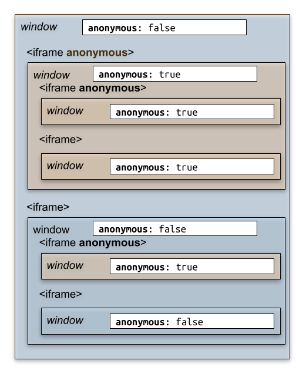

# Anonymous iframe とは

@tags: [iframe, spec, COEP, CORP]

@date: [2022-09-27, 2022-10-11]

## はじめに

[Anonymous iframe](https://wicg.github.io/anonymous-iframe/) という仕様がある。
この仕様が何を問題としていて、何を解決するための仕様なのかをまとめる。

## tl;dr

Anonymous iframe は COEP (Cross Origin Embedder Policy) require-corp 環境下で外部リソースの利用が制限された状態あっても、安全な形で iframe を利用するための仕様である。

親から iframe でサイトを埋め込もうとすると、iframe 内のサイトにも COEP が指定されている必要がある。

サードパーティのサイトである場合、COEP を指定してもらうことが難しいか、あるいは時間がかかることがある。そのため、自分のサイトで COEP を指定しようとしても、サードパーティのサイトを iframe で利用したいがために、自分のサイトで COEP 指定できないことが起こりうる。

これを COEP 指定下であっても iframe を利用できるようにするための仕様が Anonymous iframe である。

## Cross Origin Embedder Policy (COEP)

COEP については、[@agektmr](https://web.dev/coop-coep/) さんの[このページ](https://web.dev/coop-coep/)が詳しい。

要するに Spectre などの CPU の脆弱性を突いてプライベートな情報を盗み取るような攻撃に対して、オプトインされた外部リソースの読み込みのみに限定することでリスクを低減するための仕様であるといえる。

ここでいう外部リソースは、iframe や script、img、ポップアップなどを含んでいる。

COEP には、Cross Origin Resource Policy (CORP) の理解が欠かせないので紹介する。

## Cross Origin Resource Policy (CORP)

CORP は Resource がどこからのリクエストのときに読み込めるかを指定するためのヘッダで、下記のようなヘッダを指定できる機能である。

```http
Cross-Origin-Resource-Policy: same-site | same-origin | cross-origin
```

それぞれ、same-site のリソースのみ、same-origin のリソースのみ、cross-origin でも読み込みができることを表す。

CORP ヘッダを指定することで、画像や script などのリソースがどこで利用できるのか明示できる。そのため、開発者が意図しないサイトで利用されることを防ぐことができる。

## COEP と CORP

COEP では自身が使用する外部リソースに CORP を指定することを要求できる。COEP ヘッダには、unsafe-none (デフォルト値) か require-corp (CORP による指定が必要) を指定できる。

```http
Cross-Origin-Embedder-Policy: unsafe-none | require-corp
```

こうすることで、COEP ヘッダが指定されているドキュメントについては CORP の制約を満たしたリソースのみが存在していることになる。

COEP 指定下でリソースが CORP を指定していなくても、 CORS で許可されているリソースであれば、img や script などは下記のように [crossorigin attribute](https://developer.mozilla.org/en-US/docs/Web/HTML/Attributes/crossorigin) を指定することで、クロスオリジンのリソースであっても読み込みができるようになっている。

```html

```

(※crossorigin 指定は crossorigin="anonymous" と同様)

## COEP credentialless

また同様に COEP credentialless という[仕様](https://html.spec.whatwg.org/multipage/origin.html#coep)が [Chromium に実装](https://chromestatus.com/feature/4918234241302528)されている。(2022年10月10日現在では Chromium ベースのブラウザだけで、Safari や Firefox では実装されていない)

これはリソースのリクエストについてクレデンシャルを含まないようにすることで、パブリックなリソースしか読み込まないようにするための機能である。そうすることで、たとえ攻撃者がドキュメントの情報を窃取しようとしても表示されている内容はパブリックな情報のみなので攻撃されたときのリスクを下げることができるというものだ。

## iframe

しかし、iframe についてはこういった crossorigin attribute による指定や、 COEP credentialless による制限の緩和はできなかった。

[4.3. Make COEP:credentialless to affect \<iframe\>](https://wicg.github.io/anonymous-iframe/#alternatives-coep-credentialless)には下記のようにある。

> Originally, COEP:credentialless scope was meant to include both simple subresources like it does today, but also the &#60;iframe&#62;. The latter is very different in kind, because this is not only about the request’s credentials, but also about every storage API usage made later by the document. So it has been postponed here.

要するに、COEP credentialless で iframe が対象外となったのは iframe はそれ自身がコンテキストを生成し、iframe 内で Storage API の呼び出しや iframe 内での iframe の呼び出しなどもできるという点で img や script などとは違った性質を持つためである。
そうした背景から iframe でも外部リソースを安全に利用するための仕様が Anonymous iframe である。

## Anonymous iframe 詳解

Anonymous iframe の指定は先述の crossorigin attribute のように `anonymous` attribute を指定するだけだ。

```html
<iframe anonymous src="https://example.com">
```

`anonymous` attribute の指定はその子孫 iframe にも継承される。仕様に記載されている図がとてもわかり易いので引用する。



([Anonymous iframe](https://wicg.github.io/anonymous-iframe/#proposal-whatis)より引用)

iframe 内のドキュメントは下記の定数を参照することで自身が anonymous 指定された iframe なのかどうかを認識できる。

```javascript
widndow.anonymouslyFramed
```

Anonymous iframe では既存のクレデンシャルや shared storage は利用できない。ただし、sandboxed frame と違い blank な状態から storage API を使うことや、Cookie の登録は可能だ。クレデンシャルや storage の共有は同じ Anonymous iframe のページ内に限らるように分離されている。

### どのように分離を実現するか

Anonymous iframe では既存の storage key に変更して分離を実現している。通常、 [storage key は Origin で分離されている](https://storage.spec.whatwg.org/#storage-key)が、Anonymous iframe では iframe のトップレベルのサイトと、トップレベルのサイトごとに持つ nonce の組み合わせで storage key を区別する。こちらについてもスペックの図がわかりやすいので引用する。


([Anonymous iframe](https://wicg.github.io/anonymous-iframe/#proposal-credentials)より引用)

nonce はトップレベルサイトごとに決まり、子孫の Anonymous iframe に共有される。こうすることで、ある Origin ですでに利用されていた storage であっても、Anonymous iframe 以下であれば nonce が違うので分離が実現される。

また、同一 Origin であっても各 navigate ごとに nonce は変わるので、過去に storage を使っていたとしても再利用はできない。
ただし、back-forward cache を使って restore された場合については、storage も再利用できるので、これらの挙動には注意が必要だろう。


## その他細かなブラウザの挙動

COEP ヘッダが送られてきたときに Anonymous iframe を使って入れば、ブラウザは COEP ヘッダをチェックしないようになっている。(もともと COEP ヘッダが iframe 内のサイトでデプロイされていない課題を解決したかたので当然だが)

合わせてパスワードマネージャによるオートフィルも効かないようになる。筆者はパスワードマネージャが表示されるかどうかもフィッシング詐欺サイトではないことの目安にしていたので、パスワードマネージャが表示されないことでユーザに疑念を抱かれる懸念はありそうだ。

## おわりに

今回 Anonymous iframe という COEP ヘッダ (require-corp) 指定下で、iframe が動かない問題を解決するための仕様をまとめた。

このまとめを通して、安全に分離を実現するためにはどのように考えるべきなのかを知れた。このまとめを通して気になった点も今後まとめていきたい。

もし、何かしら間違いやコメントがあった場合、[issue](https://github.com/negibokken/bokken.io/issues) か [@bokken_](https://twitter.com/bokken_) までもらえると嬉しい。

## 参考

1. [Anonymous iframe](https://wicg.github.io/anonymous-iframe/)
2. [Making your website "cross-origin isolated" using COOP and COEP](https://web.dev/coop-coep/)
3. [Why you need "cross-origin isolated" for powerful features](https://web.dev/why-coop-coep/)
4. [sandbox attribute | HTML Standard](https://html.spec.whatwg.org/multipage/iframe-embed-object.html#attr-iframe-sandbox)
5. [Chromium Docs - Post-Spectre Threat Model Re-Think](https://chromium.googlesource.com/chromium/src/+/master/docs/security/side-channel-threat-model.md)
6. [Cross-Origin Embedder Policy](https://wicg.github.io/cross-origin-embedder-policy/)
