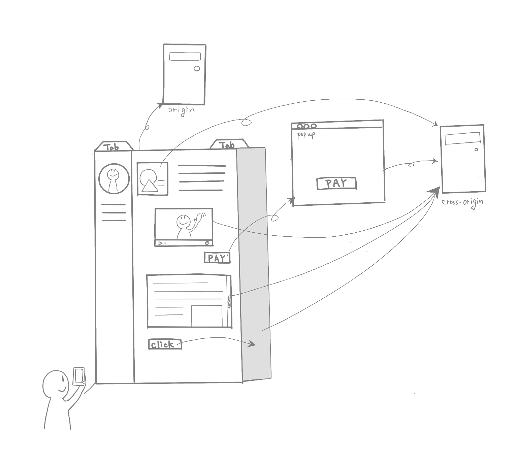

# Post Spectre 時代の Web のセキュリティについて - Post-Spectre Web Development とは

@tags: [security, spectre]

@date: [2023-09-30, 2023-09-30]

## はじめに

この記事では、「[Post-Spectre Web Development](https://www.w3.org/TR/post-spectre-webdev/)」 というドキュメントを元に、Spectre 以後の Web 開発において必要なセキュリティ関連の仕組みやヘッダの設定についてまとめる。
また、「[Post-Spectre Web Development](https://www.w3.org/TR/post-spectre-webdev/)」が公開されてから新たに追加された仕組みについても合わせて紹介し、ヘッダを設定できるようにする。

## もくじ

<!-- vim-markdown-toc Marked -->

* [Spectre によって変わった Web](#spectre-によって変わった-web)
* [Cross-Origin な読み込みが発生する箇所](#cross-origin-な読み込みが発生する箇所)
* [セキュリティ関連のヘッダ、仕組み](#セキュリティ関連のヘッダ、仕組み)
    * [Spectre 以前から存在するセキュリティ関連の仕組み・ヘッダ](#spectre-以前から存在するセキュリティ関連の仕組み・ヘッダ)
    * [Spectre 以後に登場したセキュリティ関連の仕組み・ヘッダ](#spectre-以後に登場したセキュリティ関連の仕組み・ヘッダ)
    * [Cross Origin Opener Policy (COOP)](#cross-origin-opener-policy-(coop))
    * [Cross Origin Resource Policy (CORP)](#cross-origin-resource-policy-(corp))
    * [Cross Origin Embedder Policy (COEP)](#cross-origin-embedder-policy-(coep))
    * [Cross Origin Read Blocking (CORB) / Opaque Response Blocking (ORB)](#cross-origin-read-blocking-(corb)-/-opaque-response-blocking-(orb))
* [Post-Spectre 開発におけるセキュリティ関連のヘッダの設定](#post-spectre-開発におけるセキュリティ関連のヘッダの設定)
    * [A. サブリソース](#a.-サブリソース)
        * [A.1. 静的サブリソース](#a.1.-静的サブリソース)
        * [A.2. 動的サブリソース](#a.2.-動的サブリソース)
            * [A.2.1. アプリケーションの内部レスポンス](#a.2.1.-アプリケーションの内部レスポンス)
            * [A.2.1 パーソナライズされた cross-origin で使われるリソース](#a.2.1-パーソナライズされた-cross-origin-で使われるリソース)
            * [A.2.2 cross-origin に no-cors で読み込むリソース](#a.2.2-cross-origin-に-no-cors-で読み込むリソース)
    * [B. ドキュメント](#b.-ドキュメント)
        * [B.1. Fully-Isolated なドキュメント](#b.1.-fully-isolated-なドキュメント)
        * [B.2. cross-origin の window から開かれるドキュメント](#b.2.-cross-origin-の-window-から開かれるドキュメント)
        * [B.3. cross-origin の opener から開かれるドキュメント](#b.3.-cross-origin-の-opener-から開かれるドキュメント)
            * [B.3.1 cross-origin のポップアップで開かれるドキュメント](#b.3.1-cross-origin-のポップアップで開かれるドキュメント)
            * [B.3.2 cross-origin の frame に読み込まれるドキュメント](#b.3.2-cross-origin-の-frame-に読み込まれるドキュメント)
            * [B.3.3 cross-origin のポップアップと frame の両方をサポートするドキュメント](#b.3.3-cross-origin-のポップアップと-frame-の両方をサポートするドキュメント)
* [その他のセキュリティのための取り組み](#その他のセキュリティのための取り組み)
    * [Chromeチームによる意思決定](#chromeチームによる意思決定)
    * [credentialless](#credentialless)
    * [デフォルトの挙動をどうするのか](#デフォルトの挙動をどうするのか)
* [おわりに](#おわりに)
* [参考リンク](#参考リンク)

<!-- vim-markdown-toc -->

## Spectre によって変わった Web

Spectre は Web の脅威モデルをすっかり変えてしまった。そのように言われてから 5 年ほど経った。

(ココもう少し表現の仕方がありそう)
これまで Web ブラウザは Same-Origin Policy (SOP) という、Origin ごとにリソースの認可を制御する仕組みによってユーザのリソースを守ろうとしてきた。しかし、Spectre によって**同一プロセスのメモリ上にデータが展開されるだけで危険**な状態になってしまった。

Web サイトでは他のオリジンのリソースをドキュメントに組み込んでコンテンツを作ることができる。Web ブラウザのアーキテクチャによっては、異なるオリジンのコンテンツを同一プロセスのメモリ上に展開する実装となっていることもあった。
そのため、ある悪意のあるサイトが、センシティブな情報を持つログイン済みのサイトを読み込んで、センシティブな情報を奪取することが可能であった。

この Web の特徴から、Web ブラウザは Spectre の影響を大きく受けてしまい、その影響は今もなお続いている。

Spectre は CPU の脆弱性を利用した攻撃なため、「CPU ベンダが脆弱性の修正を施して Spectre を再現できなくなったときに Web は元に戻るのか」、というとそうではない。
Spectre 以外であっても、同一プロセス上のメモリを読む攻撃が見つかる可能性は依然としてある。**Spectre (の発見) は Web の脅威モデルをすっかり変えて、不可逆のものにしてしまった**。つまり、Spectre を期に追加された様々なセキュリティ関連のヘッダや、HTML タグの属性を無視して過ごすことはできない。

本記事では、そのセキュリティ周りのヘッダがなぜ必要なのかをまとめて、実際に適用できるようになることを目指す。

## Cross-Origin な読み込みが発生する箇所

ブラウザが Cross-Origin なリソースを読み込んだり、 Cross-Origin なサイトと通信できるようになるケースについて整理すると、下記のようなケースが存在する。

1. window.open で新しい URL を開いたとき (window の参照)
1. frame, iframe, embed, object 他、frame でドキュメントやその他リソースを読み込んだとき (frame の参照など)
1. サブリソースのうち script の読み込み
1. サブリソースのうち img, css, video などの script 以外のサブリソースの読み込み
1. xhr, fetch などのフェッチリクエストを実行するとき

図にすると次のようになっている。



このそれぞれのケースで Cross-Origin なリソースを読み込むケースがあり、Cross-Origin の際には必要に応じてプロセスを分離することを考えなければいけない。必要に応じてというのが、難しいところだ。

そもそも、同一プロセスのメモリに読み込まれることが問題なら、ブラウザがデフォルトでCross-Origin なリソースを読み込む際には自動的にプロセスを分離してしまえばいいと思うかもしれない。
しかし、それはリソースと互換性の観点から難しい。Web サイトには無数のCross-Origin なリソースが読み込まれる可能性があり、そのリソースのためにプロセスを生成してメモリを消費すると大量のリソースが消費されてしまう。
また、ブラウザが Cross-Origin のリソースを分離して、iframe などと完全に通信できないようにしてしまうと、iframe を使ったシングルサインオンなどの機能が壊れてしまうことになる。

そのため、少なくとも現状ではユーザ（サイトオーナー）が自分自身のサイトやリソースをどのように扱ってほしいか、ブラウザに伝える必要がある。
ただし、今後、ブラウザがリスクに応じてデフォルトで分離することも検討が進んでいる。このことについては後の節で紹介する。

## セキュリティ関連のヘッダ、仕組み

Site Isolation、CORB/ORB はそもそもの設定、
オプトインで CORP と COOP と COEP が追加されている。
あと他にもある。

これらのすべてについて、意図せず cross-origin にリソースが読み込まれるのを防がなければいけない。

そもそもすべてのコンテンツを別プロセスで読み込んでレンダラで結合するだけにすれば良いとする説もある。
しかし、その場合には、プロセスを大量に生成することになり、メモリなどのリソースを大量に消費してしまう。
また、IPC や Mojo といったプロセス間通信を多用することになる。プロセス間通信は比較的遅いため、この方法はあまり現実的ではないのが現状だ。

### Spectre 以前から存在するセキュリティ関連の仕組み・ヘッダ

Spectre 以前からも、下記のような仕組みやヘッダが存在している。

* **Cross Origin Resource Sharing (CORS)**
    * サイト A (a.example.com) から cross-origin のサイト B (b.example.net) にあるリソースを使いたいときに、サイト B のリソースがどの origin  で使えるのか制御するための仕組み
    * `Access-Control-Allow-Origin` や、`Access-Control-Allow-Methods`、`Access-Control-Allow-Headers` などのヘッダを返すことで、サイト B のリソースに対してアクセスできる origin や、実行できるメソッド、使えるヘッダなどを指定できる。
    * 厳密にはもう少し色々あるので別の CORS に関するサイトやドキュメントを参照していただきたい
    * <font color="red">no-cors とはどういうことかについて説明したい</font>
* **X-Content-Type-Options**
    * `nosniff` を指定することで、リクエストの利用先が style や script のときに Content-Type が style や script のものでないときに、リクエストがブロックされるようになる
        * <font color="red">これはどういう理由で使うべきなのか補足する。ORB との関連も含めて</font>
* **X-Frame-Options**
    * `<frame>` や `<iframe>`、 `<embed>`、 `<object>` といった外部コンテンツを組み込むことができる要素に対して、読み込みを許可するかどうかを指定できる
    * X-Frame-Options の値としては `DENY` か `SAMEORIGIN` を指定できる。`ALLOW-FROM <origin>` も存在していたが、現在では使われておらず、代わりに Content-Security-Policy の frame-ancestors を使う
    * Click ジャッキングを防ぐことができる他、意図しない cross-origin に frame として読み込まれることを防ぐことができる
        * [Out-of-Process iframes (OOPIFs)](https://www.chromium.org/developers/design-documents/oop-iframes/) といった frame のプロセスを分離する仕組みが無いブラウザの場合、同一プロセスのメモリに展開されるので攻撃対象になる危険性があるため、指定によって危険性を低減できる

これらは Spectre 以後も有効な仕組み・ヘッダである。これらの仕組みやヘッダで防げているのは次の図の部分である。


しかし、これらの仕組みやヘッダだけではカバーできなかった範囲がある。それを次節のような仕組みやヘッダで守るようになった。

### Spectre 以後に登場したセキュリティ関連の仕組み・ヘッダ

Spectre 以後に登場したセキュリティ関連の仕組み・ヘッダは下記のようなものがある。

* Cross Origin Opener Policy (COOP)
* Cross Origin Resource Policy (CORP)
* Cross Origin Embedder Policy (COEP)
* Cross Origin Read Blocking (CORB) / Opaque Response Blocking (ORB)

それぞれについて簡単に説明する。

### Cross Origin Opener Policy (COOP)


<font color="red">Openerの話</font>
Opener の話。


### Cross Origin Resource Policy (CORP)

<font color="red">Resourceの話</font>


### Cross Origin Embedder Policy (COEP)

<font color="red">COEPの話</font>


### Cross Origin Read Blocking (CORB) / Opaque Response Blocking (ORB)

<font color="red">MIME-base のチェックによる信頼性の向上。</font>


## Post-Spectre 開発におけるセキュリティ関連のヘッダの設定

これまで紹介してきた Spectre 以後に開発されたヘッダや仕組みを使うことで、同じメモリに意図しない cross-origin のリソースが読み込まれることは回避できるようになった。

この節では具体的な設定値を [Post-Spectre Web Development](https://www.w3.org/TR/post-spectre-webdev/) に書いてあるものを参照して概観する。

「[Post-Spectre Web Development](https://www.w3.org/TR/post-spectre-webdev/) 」には下記のように分けて考えてヘッダを設定すべきというように解説がある(見分けやすくするために採番)。

* A. サブリソース
    * A.1. 静的サブリソース
    * A.2. 動的サブリソース
        * A.2.1. アプリケーションの内部レスポンス
        * A.2.1 パーソナライズされた cross-origin で使われるリソース
        * A.2.2 cross-origin に no-cors で読み込むリソース
* B. ドキュメント
    * B.1. Fully-Isolated なドキュメント
    * B.2. cross-origin の window から開かれるドキュメント
    * B.3. cross-origin の opener から開かれるドキュメント
        * B.3.1 cross-origin のポップアップで開かれるドキュメント
        * B.3.2 cross-origin の frame に読み込まれるドキュメント
        * B.3.3 cross-origin のポップアップと frame の両方をサポートするドキュメント

これまでのヘッダの説明を踏まえて順番に見ていく。

### A. サブリソース

サブリソースには、大きく静的サブリソースと動的サブリソースがある。次節からそれぞれ紹介する。


#### A.1. 静的サブリソース

```http
Access-Control-Allow-Origin: *
Cross-Origin-Resource-Policy: cross-origin
Timing-Allow-Origin: *
Content-Security-Policy: sandbox
Cross-Origin-Opener-Policy: same-origin
X-Content-Type-Options: nosniff
X-Frame-Options: DENY
```

#### A.2. 動的サブリソース

動的サブリソースには、「アプリケーションの内部レスポンス」、「パーソナライズされた cross-origin で使われるリソース」、「cross-origin に no-cors で読み込むリソース」の 3 つがある。それぞれ紹介する。

##### A.2.1. アプリケーションの内部レスポンス

```http
Cross-Origin-Resource-Policy: same-origin
Content-Security-Policy: sandbox
Cross-Origin-Opener-Policy: same-origin
Vary: Sec-Fetch-Dest, Sec-Fetch-Mode, Sec-Fetch-Site
X-Content-Type-Options: nosniff
X-Frame-Options: DENY
```

##### A.2.1 パーソナライズされた cross-origin で使われるリソース

```http
Access-Control-Allow-Credentials: true
Access-Control-Allow-Origin: https://trusted.example
Access-Control-Allow-Methods: POST
Access-Control-Allow-Headers: ...
Access-Control-Allow-...: ...
Cross-Origin-Resource-Policy: same-origin
Content-Security-Policy: sandbox
Cross-Origin-Opener-Policy: same-origin
Vary: Sec-Fetch-Dest, Sec-Fetch-Mode, Sec-Fetch-Site
X-Content-Type-Options: nosniff
X-Frame-Options: DENY
```

##### A.2.2 cross-origin に no-cors で読み込むリソース

```http
Cross-Origin-Resource-Policy: cross-origin
Content-Security-Policy: sandbox
Cross-Origin-Opener-Policy: same-origin
Vary: Sec-Fetch-Dest, Sec-Fetch-Mode, Sec-Fetch-Site
X-Content-Type-Options: nosniff
X-Frame-Options: DENY
```

### B. ドキュメント

ドキュメントには「Fully-Isolated なドキュメント」、「cross-origin の window から開かれるドキュメント」、「cross-origin の opener から開かれるドキュメント」の 3 種類のケースがある。それぞれ紹介する。

#### B.1. Fully-Isolated なドキュメント

```http
Cross-Origin-Opener-Policy: same-origin
Cross-Origin-Resource-Policy: same-origin
Vary: Sec-Fetch-Dest, Sec-Fetch-Mode, Sec-Fetch-Site
X-Content-Type-Options: nosniff
X-Frame-Options: SAMEORIGIN
```

#### B.2. cross-origin の window から開かれるドキュメント

```http
Cross-Origin-Opener-Policy: same-origin-allow-popups
Cross-Origin-Resource-Policy: same-origin
Vary: Sec-Fetch-Dest, Sec-Fetch-Mode, Sec-Fetch-Site
X-Content-Type-Options: nosniff
X-Frame-Options: SAMEORIGIN
```

#### B.3. cross-origin の opener から開かれるドキュメント

cross-origin の opener から開かれるドキュメントとしては、「cross-origin のポップアップで開かれるドキュメント」、「cross-origin の frame に読み込まれるドキュメント」、「cross-origin のポップアップと frame の両方をサポートするドキュメント」の 3 ケースがある。それぞれ紹介する。

##### B.3.1 cross-origin のポップアップで開かれるドキュメント

```http
Cross-Origin-Resource-Policy: same-origin
Cross-Origin-Opener-Policy: unsafe-none
Vary: Sec-Fetch-Dest, Sec-Fetch-Mode, Sec-Fetch-Site
X-Content-Type-Options: nosniff
X-Frame-Options: SAMEORIGIN
```

##### B.3.2 cross-origin の frame に読み込まれるドキュメント

```http
Cross-Origin-Resource-Policy: same-origin
Cross-Origin-Opener-Policy: same-origin
Vary: Sec-Fetch-Dest, Sec-Fetch-Mode, Sec-Fetch-Site
X-Content-Type-Options: nosniff
X-Frame-Options: ALLOWALL
```

##### B.3.3 cross-origin のポップアップと frame の両方をサポートするドキュメント

```http
Cross-Origin-Resource-Policy: same-origin
Cross-Origin-Opener-Policy: unsafe-none
Vary: Sec-Fetch-Dest, Sec-Fetch-Mode, Sec-Fetch-Site
X-Content-Type-Options: nosniff
X-Frame-Options: ALLOWALL
```

## その他のセキュリティのための取り組み

### Chromeチームによる意思決定

開発者たちは、ユーザのデータを守ることと、Web の互換性を守ることを考えてどういった対応が必要か検討したようだ。
「[Long-Term Web Browser Mitigations for Spectre - Google Docs](https://docs.google.com/document/d/1dnUjxfGWnvhQEIyCZb0F2LmCZ9gio6ogu2rhMGqi6gY/edit#heading=h.9ccugcg4ngnq)」に記載がある。

<font color="red">ここの記載を熱くする</font>

### credentialless

credentialless という文言を聞いたことがあるかもしれない。
credentialless という名前がついているものは、クロスオリジンのリソースを読み込むときには、Cookie など(追加)の credential を送らないようにするものだ。たとえば、iframe credentialless がそれにあたる。

Cookie を利用して取得するリソースはプライベートなリソースの可能性が高い。credentialless な要素は意図しないドキュメントにプライベートな情報が読み込まれるのを防ぐことができる。

<font color="red">ここの記載を熱くする</font>

### デフォルトの挙動をどうするのか

これまでのヘッダを設定していなければ Spectre による攻撃の対象となり得る。設定していなければ

Spectre などの同じプロセスのメモリを読み込む攻撃はブラウザベンダと Web コミュニティの努力で防ぐ方法が確立しつつある。しかし、依然としてセキュリティ関連のヘッダ設定を済ませていないサイトが多くあるのも事実である。

ブラウザがデフォルトの挙動を変更できれば良いのだが、Web の互換性を守るためには慎重になる必要があるようだ(もしかしたら実現できないかもしれない)。

<font color="red">ここの記載を熱くする</font>

Mike West 氏の発表がある。
https://speakerdeck.com/mikewest/isolation-by-default
TPAC でも、Credentialless iframe をデフォルトの挙動にしようという提案について議論もされている(少なくとも今はデフォルトにはならないようだ)。


## おわりに

今回、Spectre 以後に登場したセキュリティ関連のヘッダや仕組みについて紹介した。

ブラウザベンダの活躍を待つだけなく、**Web のコミュニティのそれぞれができることを少しずつでもやっていくとよさそうだ。具体的には、今回のセキュリティヘッダの設定だ**。読み込まれるドキュメントやサブリソースにヘッダが設定されることで、意図して共有している/していないのか、あるいは共有していないのかが分かる。リソースオーナーが読み込みを拒否して壊れるサイトがあっても、それは仕方がないと判断できる。

セキュリティヘッダの設定が十分に行き渡り、意図せず互換性が崩れるリスクが十分に下がれば、ブラウザのデフォルトの挙動を変更することができる。**デフォルトで安全な Web の実現はセキュリティヘッダの設定が難しいユーザ層が、安心して Web というコミュニティに参加できるようにするためには必要**なことのように思う。

この記事を読んで少し自分のサイトの設定を見直して見るきっかけになればと思っている。

もしも、誤りや補足の情報があれば [issue](https://github.com/negibokken/bokken.io/issues) や [@bokken_](https://twitter.com/bokken_) までいただけると嬉しい。


## 参考リンク

* [Post-Spectre Web Development](https://www.w3.org/TR/post-spectre-webdev/)
* [Notes on the threat model of cross-origin isolation](https://arturjanc.com/coi-threat-model.pdf)
* [Making your website "cross-origin isolated" using COOP and COEP](https://web.dev/coop-coep/)
* [COOP and COEP Explained](https://docs.google.com/document/d/1zDlfvfTJ_9e8Jdc8ehuV4zMEu9ySMCiTGMS9y0GU92k/edit)
* [Out-of-Process iframes (OOPIFs)](https://www.chromium.org/developers/design-documents/oop-iframes/)
* [Origin 解体新書](https://zenn.dev/jxck/books/origin-anatomia)
* [Spectre の脅威とウェブサイトが設定すべきヘッダーについて](https://blog.agektmr.com/2021/11/browser-security.html)
* [Out-of-Process iframes (OOPIFs)](https://www.chromium.org/developers/design-documents/oop-iframes/)
* [Chromium Blog: Mitigating Side-Channel Attacks](https://blog.chromium.org/2021/03/mitigating-side-channel-attacks.html)
* [Site Isolation](https://www.chromium.org/Home/chromium-security/site-isolation/)
[Site Isolation Design Document](https://www.chromium.org/developers/design-documents/site-isolation/#requirements)
* [Chromium Docs - Process Model and Site Isolation](https://chromium.googlesource.com/chromium/src/+/main/docs/process_model_and_site_isolation.md)
* [Google Online Security Blog: A Spectre proof-of-concept for a Spectre-proof web](https://security.googleblog.com/2021/03/a-spectre-proof-of-concept-for-spectre.html)
* [Chromium Docs - Process Model and Site Isolation](https://chromium.googlesource.com/chromium/src/+/main/docs/process_model_and_site_isolation.md)
* [Site Isolation for web developers - Chrome for Developers](https://developer.chrome.com/blog/site-isolation/)

Improving extension security with out-of-process iframes - May 2017
Mitigating Spectre with Site Isolation in Chrome - July 2018
Improving Site Isolation for Stronger Browser Security / Recent Site Isolation improvements - October 2019
Mitigating Side-Channel Attacks / A Spectre proof-of-concept for a Spectre-proof web - March 2021
Protecting more with Site Isolation / Privacy and performance, working together in Chrome - July 2021
