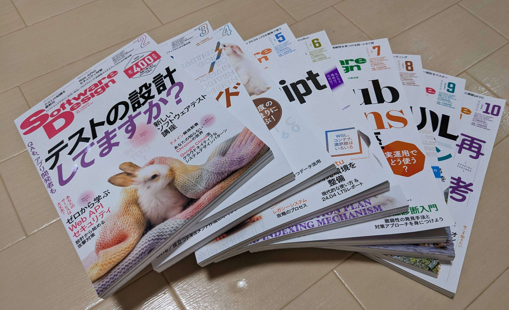

# 「あなたの知らないChromeの世界」の連載終了によせて

@tags: [chromium, Software Design, 執筆]

@date: [2024-10-18, 2024-10-18]

## はじめに

今月の[Software Design 2024年11月号](https://gihyo.jp/magazine/SD/archive/2024/202411)で、[以前に紹介した「あなたの知らないChromeの世界」の連載](/articles/2024-01-31/software-design-2024-02.html)が無事に終了しました。
至らない点もあったかもしれませんが、無事に連載を終えることができてほっとしています。
読んでくださった方がいたら、ありがとうございました。

## 連載中紹介したトピック

「あなたの知らないChromeの世界」では次のトピックについて紹介しました。

1. 「Google Chromeの登場」, [Software Design 2024年2月号](https://gihyo.jp/magazine/SD/archive/2024/202402)
1. 「Chromiumとは」, [Software Design 2024年3月号](https://gihyo.jp/magazine/SD/archive/2024/202403)
1. 「レンダリングエンジンのしくみとBlink」, [Software Design 2024年4月号](https://gihyo.jp/magazine/SD/archive/2024/202404)
1. 「JavaScriptエンジンのしくみとV8」, [Software Design 2024年5月号](https://gihyo.jp/magazine/SD/archive/2024/202405)
1. 「Progressive Web Appのしくみ」, [Software Design 2024年6月号](https://gihyo.jp/magazine/SD/archive/2024/202406)
1. 「ChromeのセキュリティとSpectre」, [Software Design 2024年7月号](https://gihyo.jp/magazine/SD/archive/2024/202407)
1. 「Spectre以降のブラウザベンダーの取り組みとChrome」, [Software Design 2024年8月号](https://gihyo.jp/magazine/SD/archive/2024/202408)
1. 「Webページの表示を高速化するSpeculation Rules API」, [Software Design 2024年9月号](https://gihyo.jp/magazine/SD/archive/2024/202409)
1. 「サードパーティCookieとPrivacy Sandbox」, [Software Design 2024年10月号](https://gihyo.jp/magazine/SD/archive/2024/202410)
1. 「Privacy Sandboxを巡るWebの今後」[Software Design 2024年11月号](https://gihyo.jp/magazine/SD/archive/2024/202411)

いずれの記事も6-8ページと比較的短いので、ざっとChromeのことを知りたいと思ってくれた人には役に立つ連載になったのではないかと思います。
**Webの発展における、Chromeや、Chrome開発者の方々の取り組みのすごさ**が伝わればよいなと思って書いていました。
他の人があまりやっていない形でのChrome、Chromiumへのコントリビューションだと思うので、なにかの役に立てていれば良いなと思っています。

## 謝辞

なお、連載では、技術評論社編集の栗木さん([@g_krk3](https://twitter.com/g_krk3))には本当にお世話になりました。
毎月ギリギリまで校正、修正作業をしていただきました。

栗木さんには、論理的におかしな点や、補足が必要な点などを丁寧に見ていただいたおかげで記事という形に仕上げることができました。
連載中は本当に文章のプロの技量に驚かされてばかりで、自分が平易でありきたりな言葉でしか表現できなかった部分を、的確でかっこいい文章表現に変えて修正提案をしてくださいました（言い回しがかっこよいなという文があった場合はだいたい栗木さんに提案いただいたものだと思います）。

連載企画のスタート時には本当に自分だけで連載を乗り切れるのか不安で仕方ありませんでしたが、栗木さんが併走してくださったおかげでなんとか連載を終えることができました。
連載という機会をいただいたこと、一緒に連載を作っていただいたこと、あらためてありがとうございました。

## おわりに

一旦、月刊誌への連載はこれで終わりで、また執筆はほそぼそとブログ記事を通してやっていこうとおもっています。
加えて、Chromiumへのコードへのコントリビューションを改めてやっていきたいと思っています。
よりChrome、ChromiumやWebのことをより深く理解できるように引き続きやっていきます。
引き続き [@bokken_](https://twitter.com/bokken_) をよろしくお願いします。
