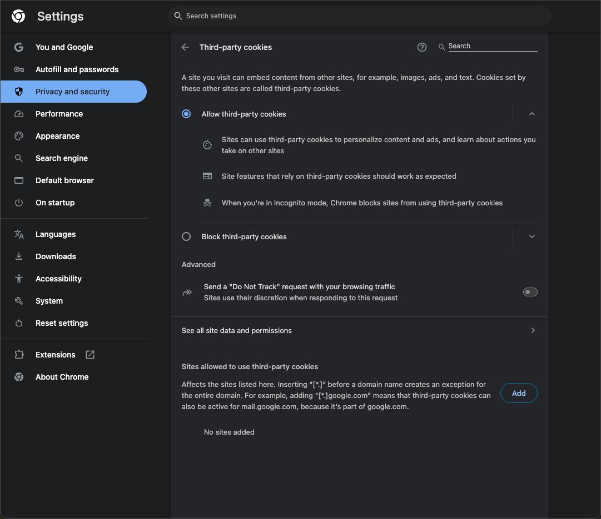
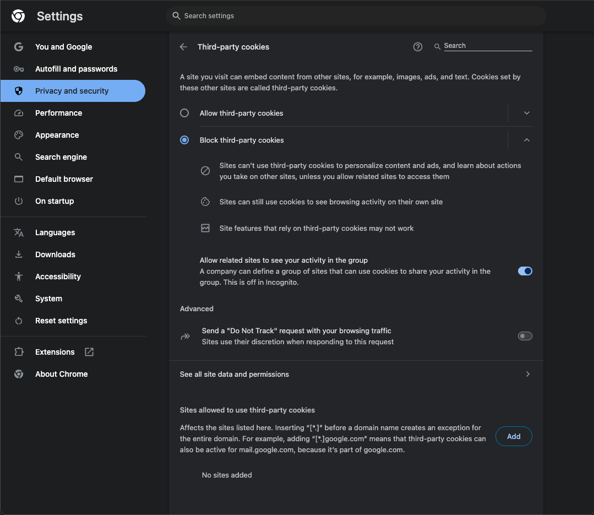
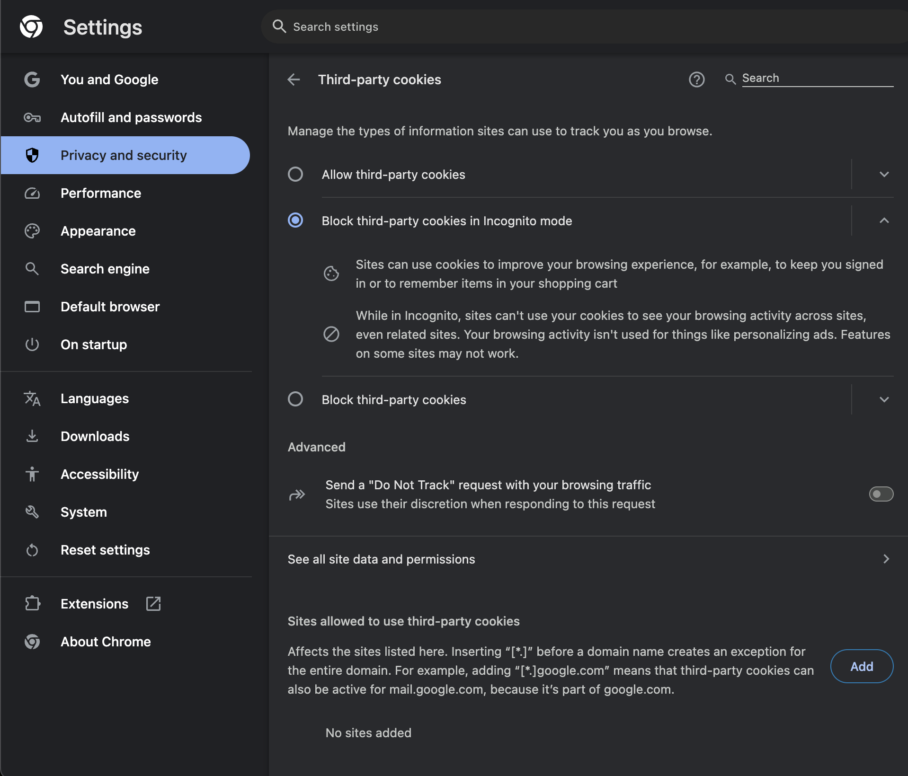
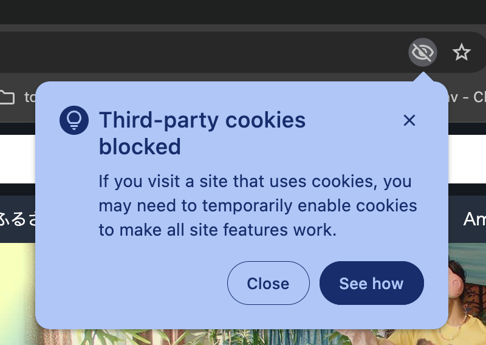
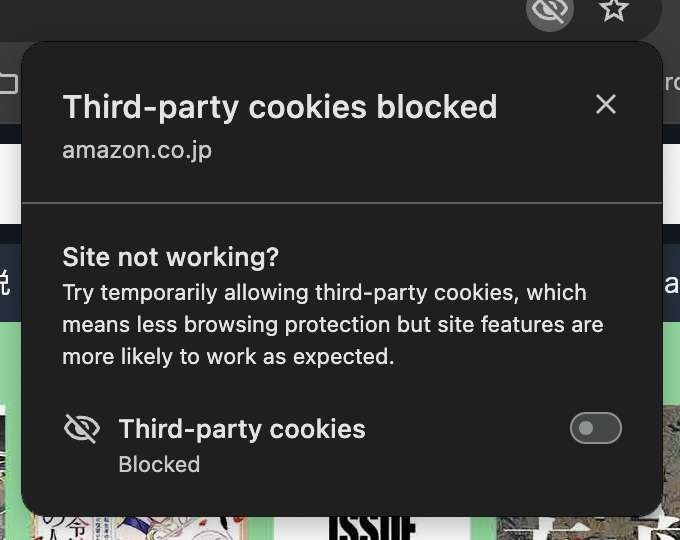
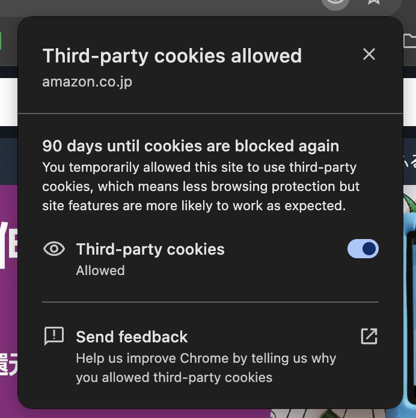
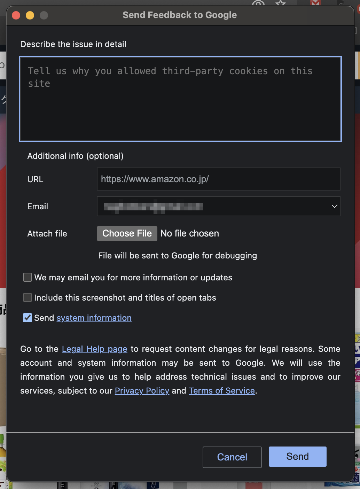
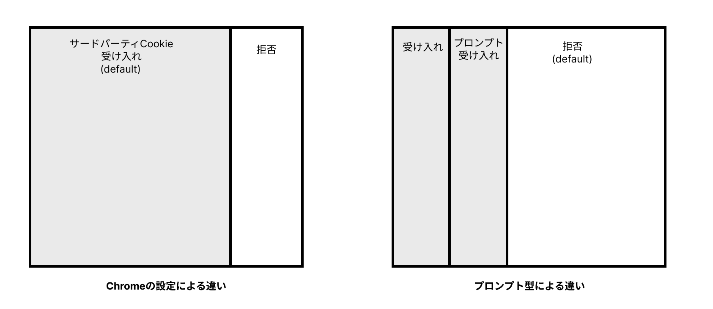
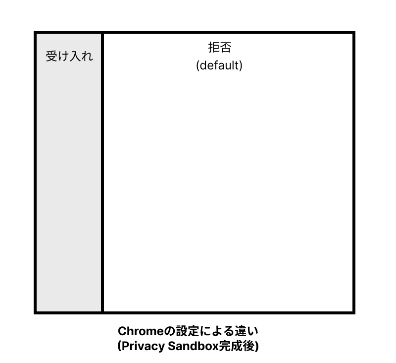

# Chromeのプロンプト型サードパーティCookie受け入れ機能撤回の考察

@tags: [3PC, Chrome]

@date: [2025-04-30, 2025-04-30]

## はじめに

4月22日に発表されたPrivacy Sandboxの再度の方向転換が話題になった（「[Next steps for Privacy Sandbox and tracking protections in Chrome](https://privacysandbox.com/news/privacy-sandbox-next-steps/)」。この発表では、これまでプロンプト型でサードパーティCookieの受け入れをユーザに選択できるようにする機能を撤回したことが発表された。

この記事では、なぜChromeがサードパーティCookieを受け入れるプロンプトを検討していたのか、そしてなぜ今回プロンプト型のサードパーティCookie受け入れ機能を撤回したのかをGoogleとCMA（英競争・市場庁）とのやりとりをもとに考察する。

## 発表で述べられていたこと

発表の中では、下記のように述べられている。

> Taking all of these factors into consideration, we’ve made the decision to maintain our current approach to offering users third-party cookie choice in Chrome, and will not be rolling out a new standalone prompt for third-party cookies. Users can continue to choose the best option for themselves in Chrome’s Privacy and Security Settings.
>
> これらの要素をすべて考慮し、ChromeでサードパーティCookieの選択をユーザーに提供する現在のアプローチを維持し、サードパーティCookieのための新しい独立したプロンプトを展開しないことを決定しました。ユーザーは引き続き、Chromeのプライバシーとセキュリティの設定で、自分に最適な選択肢を選ぶことができます。

つまり、プロンプト型サードパーティCookie受け入れ機能を撤回して、これまで通りChromeのプライバシーとセキュリティの設定でサードパーティCookieをすべて受け入れるか、すべて拒否するかを選択するような方針となった。

## プロンプト型サードパーティCookieの受け入れ機能

まずはじめに、プロンプト型のサードパーティCookie受け入れ機能と従来通りのChromeの設定機能について簡単に紹介する。

プロンプト型の機能がどういった形になるのかはGoogleからあまり大々的に紹介されてこなかったが、機能とおぼしきものはロールアウトされていたようである。
Chromeでは、[chrome://settings/cookies](chrome://settings/cookies) で下記のCookieに関する設定画面を開くことができる。

設定画面では、「Allow third-party cookies」と「Block third-party cookies」を選択できる。

これだけでは、全サードパーティCookieを受け入れるか、拒否するかしか選べない。

あるいは、下記のように Block third-party cookies in Incognito modeがデフォルトで設定されるパターンもある。

これがこれまで通りのChromeの設定画面で選択できるサードパーティCookieの取り扱いである。

さらにここから「Block third-party cookies」を選択するとサードパーティCookieを利用しているサイトでは次のような表示がURLバーの部分に出てくる。

さらに「See how」をクリックすると訪れているサイトでサードパーティCookieを有効化することができる。

これがおそらくプロンプトベースのユーザ選択のことを言っていたか、ベースになる機能だと思われる。
さらに、有効化すると「90日後にもう一度サードパーティCookieをブロックする。閲覧保護機能が働かないが、サイトの機能は期待通りに動く」というようなメッセージが表示される。

最下部には「Send feedback」で「なぜサードパーティCookieを有効化したのか教えてほしい」という表示がある。

プロンプトに表示されるメッセージから察するに、あくまでもサイトの機能が壊れてしまって一時的にサードパーティCookieを有効化するために用意した機能であるようだ。

つまり、「ユーザがプロンプトでサードパーティCookieを受け入れれば、特定の広告企業でずっとトラッキング広告を可能にする」ために利用できる機能ではないことがうかがえる。
メッセージや、90日後にブロックを再開する挙動は、この機能が悪用されないように慎重にデザインされた機能であるように感じられる。

## Chromeの設定とプロンプトによる設定の違い

Chromeの設定画面での選択と、プロンプトによる設定の違いは「サイトごとにサードパーティCookieを受け入れるか選択できる」ということである（もしかしたらサードパーティCookieごとに選択できるようにはなる想定だったのかもしれないが）。

このことはデフォルトの挙動が変わることを意味する。つまり、Chromeの設定ではデフォルトでサードパーティCookieを受け入れ(Incognito modeでのみBlock)するが、プロンプト型による場合はデフォルトが拒否で、プロンプトで個別に許可する流れだ。イメージとしては次の図のようなイメージになる。

デフォルトの挙動によって、サードパーティCookieが使われる比率は大きく変わることになる。

といっても、もともとPrivacy Sandboxが完成すればデフォルトでサードパーティCookieはデフォルト

で拒否になり次の図のように多数になるので、プロンプト型の模索はPrivacy Sandboxの完成より先にデフォルト設定を変えるような意図もあったのかもしれない。

CMAも[CMA’s Q2 to Q3 2024 report](https://assets.publishing.service.gov.uk/media/6731ffb00d90eee304badaff/CMA_s_Q2_to_Q3_2024_report.pdf)で次のようにアドテク業界への影響規模を述べている。

> Google’s proposal to replace third-party cookie deprecation with a new user
> choice experience is likely to change the scale of the impact on the ad tech
> ecosystem in relation to the issues we describe in this report, because
> third-party cookies will continue to be available for some users depending on
> their choice.
>
> サードパーティCookieの非推奨を新しいユーザー選択エクスペリエンスに置き換えるというGoogleの提案は、アドテクに与える影響の規模を変える可能性が高い。
> なぜなら、サードパーティCookieは、ユーザーの選択次第で一部のユーザーにとって引き続き利用可能だからです。

Privacy Sandbox完成より前にサードパーティCookieがデフォルトで拒否になることには触れられていないが、プロンプト型によって、「プロンプト受け入れ」部分だけサードパーティCookieが使える人が増えるようになるので影響がどうなるか見定めているようだった。

また、プロンプト型の場合は将来的にサードパーティCookieが使えるユーザが増えることや、ユーザによってサードパーティCookieが使える/使えないなど挙動が生まれるのでプロンプト型は厄介な負債になりえた。

## もともとどうしてプロンプト型が提案されていたのか

ユーザの選択肢に委ねるべきであるというのは最初のGoogleからのCommitmentに対して、CMAが求めたフィードバックで提出された意見が最初のようだ。

[Notice of intention to accept modified commitments offered by Google (PDF, 2.04MB)](https://www.gov.uk/government/uploads/system/uploads/attachment_data/file/1036204/211126_FINAL_modification_notice.pdf) に下記のようにある。

> 50 Four respondents made specific submissions concerning user choice. One
>    respondent submitted that the Chrome browser should return to its purpose
>    of being a user-agent, giving consumers simple and easy control over
>    tracking. Another respondent said that any commitments should require
>    Google to ask users if they consent to websites using TPCs. Three
>    respondents said that valid user consent should be obtained for the
>    processing of personal data. One respondent submitted that users should be
>    able to say no as easily as they can say yes as regards data processing,
>    and that Google should provide a clear and easy way for users to opt out
>    of TPCs blocking in case any user reconsiders a previous decision to opt
>    in. As user controls including choice architecture and defaults are
>    already explicitly within the scope of the Initial Commitments, the CMA’s
>    provisional view is that the commitments need no modification to address
>    these points.
>
> 50 4名の回答者は、ユーザーの選択に関する具体的な提案を行った。ある回答者はChromeブラウザをユーザーエージェントとしての目的に戻し、消費者がトラッキングをシンプルかつ簡単にコントロールできるようにすべきだと述べた。また別の回答者は、サードパーティCookieを使用するウェブサイトに同意するかどうかをユーザーに尋ねることをGoogleに義務付けるべきだと述べた。3人の回答者は、個人データの処理について、有効なユーザーの同意を得るべきだと述べた。ある回答者は、ユーザーはデータ処理に関して「はい」と言うのと同じくらい簡単に「いいえ」と言うことができるべきであり、また、Googleは、ユーザーが以前にオプトインすることを決定したことを再考する場合に備えて、ユーザーがTPCのブロッキングをオプトアウトするための明確かつ簡単な方法を提供すべきであると述べた。選択アーキテクチャーやデフォルトを含むユーザーコントロールは、すでに初期コミットメントの範囲内に明確に含まれているため、CMAの暫定的な見解では、コミットメントはこれらの点に対処するための修正を必要としない。

他にも下記のように、CMAはGoogleがユーザに実質的に選択させない恐れがあることに懸念を示しているようだ。

> Concern 3: imposition of unfair terms on Chrome web users 5.53 As described in
> Chapter 3 of this Decision and listed at paragraph 7.c. of the Final
> Commitments, the CMA is also concerned that, in the absence of sufficient
> regulatory scrutiny and oversight, Google would be able to exploit its likely
> dominant position by denying Chrome web users any substantial choice in terms
> of whether and how their personal data is used for the purpose of targeting
> and delivering advertising to them. 5.54 The CMA considers that the Final
> Commitments address this competition concern, in particular through the
> following commitments:
>
> 懸念 3：Chrome ウェブユーザーへの不公正な条件の押し付け
> 5.53　本決定書の第 3 章および最終コミットメント 7.c 項で述べたとおり、十分な規制当局による監視とチェックが行われない場合、Google は広告のターゲティングと配信を目的にユーザーの個人データを「利用するかどうか」「どのように利用するか」について Chrome ウェブユーザーに実質的な選択肢を与えず、その支配的地位を悪用するおそれがあると CMA は懸念している。
>  5.54　CMA は、以下に示すコミットメントを通じて、最終コミットメントがこの競争上の懸念に対応していると判断している。

つまり、CMAは「新しいプロンプトによるユーザー選択」を導入することを示唆していたわけではなく、「既存の、あるいはコミットメント内で改善されるユーザーコントロール」を通じて、ユーザーがデータ利用について選択できる状態を確保することを重要視していたと言えそうだ。

## なぜユーザ選択型のサードパーティCookie受け入れプロンプトをやめたのか

GoogleはこれまでCMAや関連業界からのフィードバックに答えてプロンプト型を提案し実装を進めてきた。
ではなぜ、サードパーティCookieの受け入れプロンプトの道をやめたのだろうか。
ここまで、ある程度機能がロールアウトされているのに機能の方針転換をしたのはなぜなのだろうか。

その答えの一つは [CMA’s Q2 to Q3 2024](https://assets.publishing.service.gov.uk/media/6731ffb00d90eee304badaff/CMA_s_Q2_to_Q3_2024_report.pdf) にありそうだ。

CMAやはこのレポートで下記のように各種Privacy SandboxのAPIでプロンプトによって許諾を求めるとユーザが理解せずに許諾してしまう危険性について述べている。

> The close sequencing of the prompts for Topics, PA API and ARA is impacting
> user comprehension. Google’s UX research shows that users struggle to identify
> that the initial prompts for Topics, PA API and ARA are providing information
> about three different APIs. Particularly in relation to the PA API and ARA,
> our view is that the highlighting of the ‘Got it’ button on the prompt nudges
> users to dismiss the notice without reading or comprehending the information
> presented. This view is informed by the ICO-CMA joint paper on Harmful Design
> in Digital Markets which describes a ‘harmful nudge’ as ’when a firm makes it
> easy \[for\] users to make inadvertent or ill-considered decisions’. 
>
>
> Topics、PA API、ARA の各プロンプトが立て続けに表示されることで、ユーザーの理解が妨げられています。Google の UX 調査によると、ユーザーは Topics、PA API、ARA の最初のプロンプトが三つの異なる API を説明していることを認識しにくいことが分かりました。特に PA API と ARA については、プロンプト内で青色に強調表示されている「了解」ボタンが、提示された情報を読まずに通知を閉じるようユーザーを誘導していると考えられます。この見解は、ICO と CMA が共同で発表した「デジタル市場における有害なデザイン」論文で定義される「有害なナッジ」――企業がユーザーに不注意または軽率な決定をとらせやすくする設計――に基づいています。

また、その他にも[Google’s Q4 2024 report](https://assets.publishing.service.gov.uk/media/679cbbca3bd16ee4b57adf25/google_q4_2024_report.pdf "https://assets.publishing.service.gov.uk/media/679cbbca3bd16ee4b57adf25/google_q4_2024_report.pdf")で、ユーザが許可したサードパーティCookieを付与するサイトが悪用されていないかをChromeが監査することは現実的ではない、つまりユーザが危険にさらされてしまうと述べている。

> Exception Request Request for an exception to access third-party cookies
> (3PCs) for their consented users.
> 
> Consenting to device access and storage or specific data processing purposes
> doesn’t as such indicate a user wants to override their 3PC setting in Chrome.
> Allowing site-level override of a user’s 3PC settings would create
> considerable potential for misuse, and it would be infeasible for Chrome to
> audit all sites’ behavior that might lead to a request for exception.
>
> デバイスへのアクセスや保存、または特定のデータ処理目的に同意したとしても、それだけでユーザーが Chrome のサードパーティ Cookie 設定を上書きしたいと望んでいるとは限りません。サイト単位でユーザーのサードパーティ Cookie 設定を上書きできるようにすると悪用の余地が大きくなり、例外を求める可能性のあるすべてのサイトの挙動を Chrome が監査するのは現実的に不可能です。

このようにサードパーティCookieをプロンプト型で提示する方法ではユーザが危険にさらされてしまうというのがCMAとのレポートのやり取りから見られる大きな理由なようだ。

ユーザを保護するためにこれまでの方針を急に変える選択を取れるGoogleはやはりまだWebやWebのユーザのことを考えていると思う。これまでのWebの発展を支えてきたというGoogleの矜持を感じた。

## おわりに―これからサードパーティCookieはどうなるのか―

とはいえ、この選択によってサードパーティCookieを巡る状況が大きく前進したわけではない。

サードパーティCookieをデフォルトで拒否するようにしたい、というのはGoogleも願うところだろう。ただし、それはPriavacy Sandboxが完成した後だ。仕様の数は膨大で、ブラウザベンダからの反対という逆風もある。どうやって解決していくのかは、自分の立場では全然見えないが、Googleなら、Chromeならなんとかしてくれるんじゃないかとそんな期待をしている。

本記事についてなにかコメントがあれば [Bluesky](https://bsky.app/profile/bokken.bsky.social) か [X](https://x.com/bokken_) までいただけると嬉しいです。
